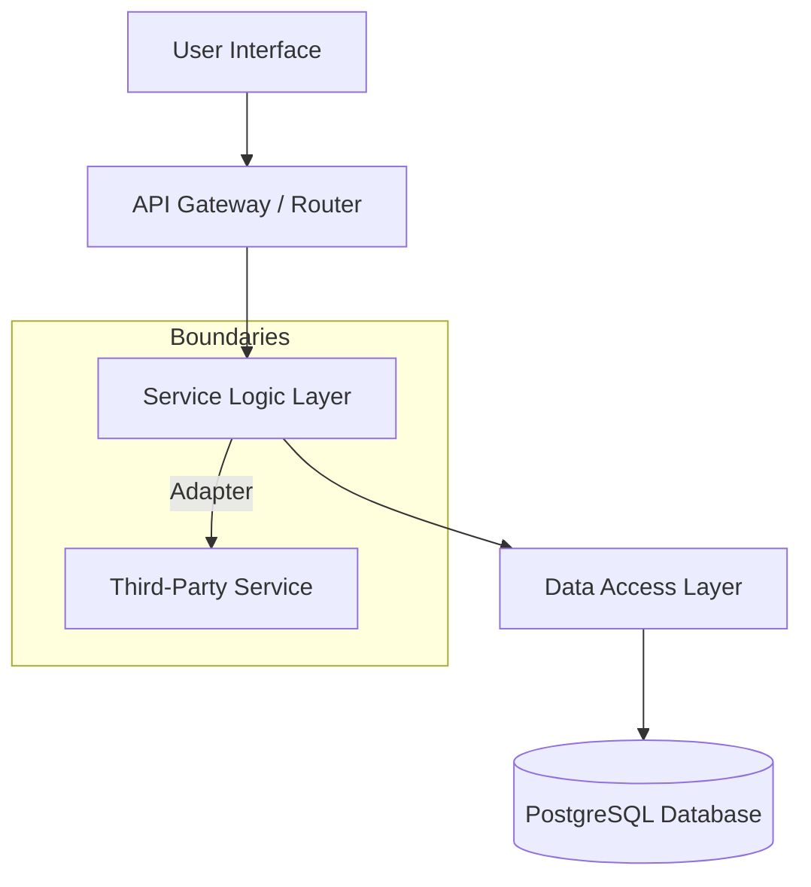

````markdown
# Architecture Documentation

A bird's-eye view of the system design, boundaries, and codebase layout.

---

## 1. System Overview

- **Domain Problem**: [One-sentence explanation of what business problem this software solves]
- **Target Audience**: [Who uses this application and what they achieve with it]
- **Core Goal**: Provide an uncompromised, resilient system for [Primary Core Feature]

## 2. Core Constraints (The "Don'ts")

- **No Shared State**: Context modules must remain fully isolated from each other.
- **No Direct DB Calls**: Frontend components must never query database instances.
- **No Third-Party Bleed**: Wrap external APIs inside internal adapters.
- **No Deep Inheritance**: Favor composition and simple utility interfaces over deep class trees.

## 3. Technology Stack

| Layer           | Technology        | Primary Responsibility                       |
| :-------------- | :---------------- | :------------------------------------------- |
| **Frontend**    | React / Next.js   | Client UI and local state orchestration      |
| **Backend API** | Node.js / Fastify | Request validation, business logic execution |
| **Database**    | PostgreSQL        | Relational storage and ACID transactions     |
| **Caching**     | Redis             | Session state and global rate limiting       |

## 4. Architectural Pattern & Data Flow

The system follows a strict **Layered Architecture**. Data flows unidirectionally from the User Interface down to the Storage Layer.



## 5. Codebase Map

```text
├── src/
│   ├── config/          # Global application configurations and environment schemas
│   ├── entrypoints/     # System entry points (server.js, workers, cron triggers)
│   ├── domains/         # Vertical slices containing isolated business domains
│   │   └── billing/     # Example domain: Handles invoices, webhooks, subscriptions
│   │       ├── components/  # Domain-specific UI primitives
│   │       ├── services/    # Business rules and internal calculations
│   │       └── db/          # Queries, transactions, and tables
│   ├── shared/          # Globally accessible utility libraries and design systems
│   └── tests/           # Integration test suites and regression hooks
```

### Entry Points

- **HTTP Server**: `src/entrypoints/server.js` — Bootstraps the global API instance.
- **Worker Queue**: `src/entrypoints/worker.js` — Processes background tasks and retry loops.

## 6. Component Design Philosophy

- **Thin Controllers**: Route handlers only validate inputs and delegate work immediately.
- **Fat Services**: Domain logic lives exclusively in pure, testable service functions.
- **Predictable UI**: Presentational components consume immutable properties; state changes bubble up via events.

## 7. Operational Guidelines & Verification

- **Local Verification**: Execute `npm run check` to validate formatting, linting, and types before creating any pull request.
- **Test Isolation**: Database unit tests must spin up an ephemeral container instance to prevent state pollution.
- **State Updates**: Always modify domain states via explicit commands, never through structural cross-mutation.
````
