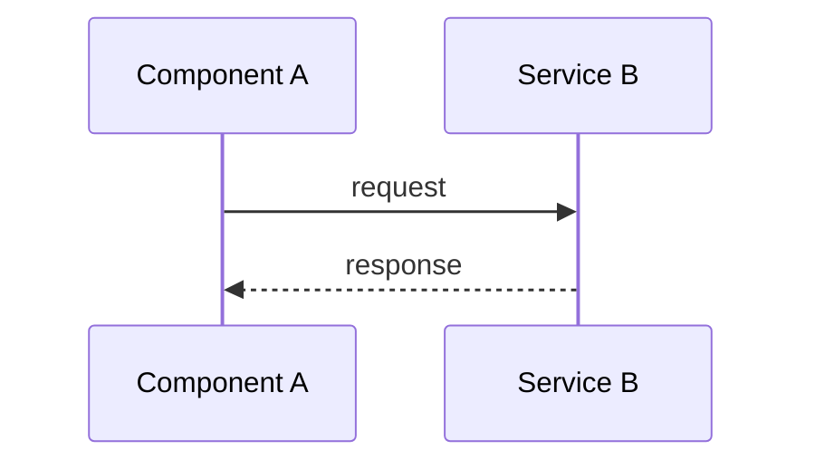

# Plan Templates

This document contains the planning template supported by the Plan skill.

### Template

````markdown
---
plan-id: YYYY-MM-DD-NNN
type: plan
title: "[Plan title]"
status: complete
tier: fast | standard | deep
tier_recommended: fast | standard | deep
complexity: TRIVIAL | LOW | MEDIUM | HIGH | VERY_HIGH
risk: Low | Medium | High | Critical
scope-id: YYYY-MM-DD-NNN-scope
research-id: YYYY-MM-DD-NNN-research
design-id: YYYY-MM-DD-NNN-design
interactionMode: detailed | smart | autopilot
created: YYYY-MM-DD
updated: YYYY-MM-DD
version: 1.0
---

## Overview

[1-2 sentence summary: what the plan delivers and why it matters]

# [Title]

## High-Level Technical Design

> **Note:** This is directional guidance for review, not an implementation specification to copy. The implementation phase will determine specific naming, abstractions, and code structure.

[Provide ONE of these:]

**Mermaid Diagram:**



**OR Pseudo-Code Sketch:**

```
on user_action:
  validate input
  if valid:
    process and store
    trigger event
  else:
    return error
```

**OR Data-Flow Map:**

```
User Input → Validation → Processing → Storage → Event Bus → Notification
```

## Implementation Units (Phased)

### Phase 1: Foundation

- U1. **[Unit Name]**
  - **Goal:** [What this unit accomplishes]
  - **Dependencies:** None
  - **Files:**
    - Create: `path/to/file`
    - Test: `path/to/test`
  - **Acceptance Criteria:**
    - [Single, verifiable criterion — each criterion later becomes exactly one task and one test]
  - **Test Scenarios:**
    - [Scenario]: [Input -> Expected Outcome]

- U2. **[Unit Name]**
  - **Goal:** [What this unit accomplishes]
  - **Dependencies:** U1
  - **Files:**
    - Create: `path/to/file`
  - **Acceptance Criteria:**
    - [Single, verifiable criterion]
  - **Test Scenarios:**
    - [Scenario]: [Input -> Expected Outcome]

### Phase 2: Integration

- U3. **[Unit Name]**
  - **Goal:** [What this unit accomplishes]
  - **Dependencies:** U1, U2
  - **Files:**
    - Modify: `path/to/file`
  - **Acceptance Criteria:**
    - [Single, verifiable criterion]
  - **Test Scenarios:**
    - [Scenario]: [Input -> Expected Outcome]

### Phase 3: Rollout (if applicable)

- U4. **[Unit Name]**
  - **Goal:** [What this unit accomplishes]
  - **Dependencies:** U3
  - **Files:**
    - Modify: `path/to/file`
  - **Acceptance Criteria:**
    - [Single, verifiable criterion]

## Alternative Approaches Considered

- **[Approach Name]**: [Description] → **Rejected because:** [Rationale for not choosing this approach]
- **[Approach Name]**: [Description] → **Rejected because:** [Rationale]

## Risk Analysis & Mitigation

| Risk                        | Impact | Mitigation                                    |
| --------------------------- | ------ | --------------------------------------------- |
| [Specific risk description] | High   | [Concrete step to prevent or recover from it] |
| [Another risk]              | Medium | [Mitigation strategy]                         |

## Operational / Rollout Notes

[Include if applicable:]

- Feature flags: `feature.new_system` controls activation
- Monitoring: Add metrics for [key operations]
- Data migration: [Steps to migrate existing data]
- Rollback plan: [How to safely revert if issues arise]
- Performance baseline: [Expected throughput, latency targets]

## Related Learnings

- **[Learning Title]** — `docs/learn/XXX.md` — [1-line applicability note]
- (List relevant entries from `docs/learn/index.md`; if none apply, state "No relevant learnings found")

## Learning Gaps

- [Any gap identified during planning that should be documented after implementation via `/learn`]
````

### Example

```markdown
---
plan-id: 2026-05-01-001
type: plan
title: "Migrate Session Storage from In-Memory to Redis"
status: complete
tier: standard
tier_recommended: standard
complexity: HIGH
risk: High
scope-id: 2026-05-01-001-scope
research-id: 2026-05-01-001-research
design-id: 2026-05-01-001-design
interactionMode: smart
created: 2026-05-01
updated: 2026-05-01
version: 1.0
---

# Migrate Session Storage from In-Memory to Redis

## High-Level Technical Design

**Session Lifecycle:**

1. Request arrives with session cookie (JWT)
2. Middleware validates JWT signature and expiration
3. Extract session ID, fetch from Redis
4. Attach session object to request context

## Implementation Units (Phased)

### Phase 1: Foundation

- U1. **Redis Client and Session Store Interface**
  - **Goal:** Create Redis client wrapper and session storage interface
  - **Files:** `src/lib/redis-client.ts` · test: `src/lib/redis-client.test.ts`
  - **Acceptance Criteria:**
    - `SessionStore` interface with `get`/`save`/`delete` backs a Redis client that connects from `REDIS_URL` and retries on failure
  - **Test Scenarios:** Store/retrieve session, TTL expiration, connection errors

### Phase 2: Integration

- U2. **Session Middleware Refactor**
  - **Goal:** Integrate Redis session store into middleware
  - **Files:** `src/middleware/session.ts` · test: `src/middleware/session.test.ts`
  - **Acceptance Criteria:**
    - Middleware loads a valid JWT-backed session from Redis and rejects invalid/expired sessions
  - **Test Scenarios:** Valid JWT loading, invalid JWT rejection, store errors

## Alternative Approaches Considered

- **PostgreSQL**: Rejected — slower latency for session reads on critical path
- **Stateless JWT-Only**: Rejected — cannot revoke sessions, increases cookie size
- **Sticky Sessions**: Rejected — limits horizontal scaling, poor failover

## Risk Analysis & Mitigation

| Risk                    | Mitigation                                     |
| ----------------------- | ---------------------------------------------- |
| Redis outage            | HA mode (sentinel/cluster), monitoring, alerts |
| Performance degradation | Benchmark latency <2ms p99, connection pooling |

## Operational / Rollout Notes

- Feature flags: `feature.redis_sessions_dual_write`, `feature.redis_sessions_only`
- Gradual cutover with dual-write phase for validation
- Sessions expire naturally; no explicit data migration needed

## Related Learnings

(List relevant entries from `docs/learn/index.md`)

## Learning Gaps

- Document session architecture decisions and Redis failover patterns
```

---

## Overview

Plans guide complex projects through structured phases. Include technical design, phased units, alternatives analysis, risk mitigation, and operational notes.

---

## Template Usage Rules

### Required Sections

Which sections a plan includes is **tier-driven**, not fixed. See [plan-tier-selection.md](../../plan-tier-selection.md) and the Generate phase ([generate.md](../../../modules/generate.md)) for the Fast/Standard/Deep section matrix (Fast omits Alternative Approaches, Operational Notes, and Learning Gaps; Standard and Deep add them). Do not render a section the tier marks optional and empty.

### File Path Requirements

- All file paths in plans must be **repository-relative** (e.g., `src/main.js`, `docs/plans/YYYY-MM-DD-NNN-name.md`)
- Never use absolute paths (e.g., `/home/user/project/src/main.js`)
- Use backtick inline code formatting for file paths: `` `path/to/file` ``

### Learnings Embedding Rules

- Every plan **must** include a `## Related Learnings` section
- Scan `docs/learn/index.md` for relevant entries
- Include file path and a 1-line applicability rationale per learning
- If no relevant learnings exist, state: "No relevant learnings found"
- Add a `## Learning Gaps` section for areas where knowledge is missing but needed
- Learning gaps should include a follow-up action to document via `/learn`

### Naming Convention

- Plan files: `docs/plans/YYYY-MM-DD-NNN-<kebab-case-name>.md`
- U-ID format: `U1`, `U2`, ... `UX` (never renumber)
- Frontmatter required fields: see the Final Plan frontmatter in the template above and [error-handling.md](../../error-handling.md) — `plan-id`, `type`, `title`, `status`, `tier`, `tier_recommended`, `complexity`, `risk`, `scope-id`, `research-id`, `design-id`, `interactionMode`, `created`, `updated`, `version`
