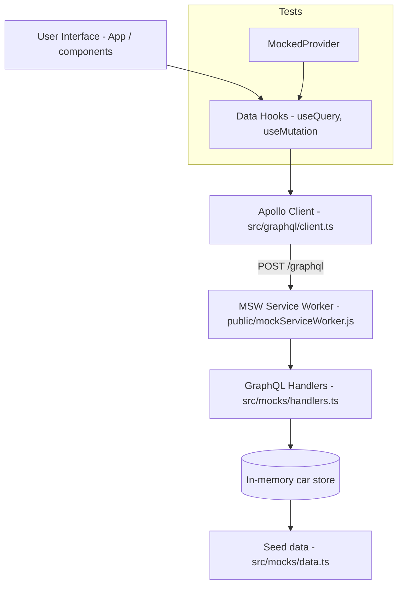

# Architecture Documentation

A bird's-eye view of the system design, boundaries, and codebase layout.

---

## 1. System Overview

- **Domain Problem**: Provide a ready-to-extend React + TypeScript boilerplate for a **Car Inventory Manager** — a UI that lists, searches, sorts, and adds cars through a GraphQL API that is mocked entirely in the browser/Node.
- **Target Audience**: Developers (and AI code-generation agents) implementing the frontend against a fixed, pre-configured stack. No backend work is expected.
- **Core Goal**: Provide an uncompromised, resilient system for **car inventory CRUD over a mocked GraphQL API**, with the API contract, types, and test harness already wired.

## 2. Core Constraints (The "Don'ts")

- **No Real Backend**: There is no server, database, Docker, or deployment layer. All GraphQL traffic is intercepted by MSW. Do not add one.
- **No Direct Data Access from Components**: Components must never import `@/mocks/*` or mutate the mock store; they go through Apollo Client.
- **No Hand-Rolled Fetch Calls**: Data access goes through the queries declared in `src/graphql/queries.ts` and Apollo's `useQuery` / `useMutation`.
- **No Third-Party Bleed**: External concerns (API endpoint, image URL strategies, viewport breakpoints) stay wrapped in hooks/components so swapping MSW for a real API is a one-file change.
- **No Auth / CI-CD / Infrastructure Scope**: Explicitly out of scope for this project.

## 3. Technology Stack

| Layer            | Technology                  | Primary Responsibility                                        |
| :--------------- | :-------------------------- | :------------------------------------------------------------ |
| **UI**           | React 19 + TypeScript       | Component tree, local state, event handling                   |
| **Styling**      | Material UI (MUI) v6        | Design system: layout, cards, forms, feedback states          |
| **Data**         | Apollo Client v3            | GraphQL requests, caching, query/mutation state               |
| **API (mock)**   | MSW v2                      | Intercepts `/graphql`; serves seeded data + in-memory mutations |
| **Build/Dev**    | Vite v6                     | Dev server, bundling, `@` → `src` path alias                  |
| **Testing**      | Vitest + Testing Library    | Unit/integration tests with `MockedProvider`                  |
| **Type Checking**| TypeScript ~5.7             | `tsc --noEmit` contract enforcement                           |

## 4. Architectural Pattern & Data Flow

The system follows a strict **Layered Frontend Architecture**. Data flows unidirectionally from the User Interface down to the mock data store; state changes bubble back up as Apollo query results.



Key points:

- **Query definitions are the contract.** `GET_CARS`, `GET_CAR`, and `ADD_CAR` in `src/graphql/queries.ts` are matched by name in `src/mocks/handlers.ts`. Renaming a query breaks the mock.
- **Mutation state is session-scoped.** `handlers.ts` keeps a module-level `cars` array cloned from seed data plus a `nextId` counter, so `AddCar` persists for the page session and resets on reload.
- **Responsive images are data-driven.** The `Car` type carries `mobile`, `tablet`, and `desktop` URLs; the presentation layer selects based on viewport (≤640px mobile, 641–1023px tablet, ≥1024px desktop).
- **Two MSW entry points.** `src/mocks/browser.ts` runs the service worker in dev; `src/mocks/server.ts` runs in the Vitest/Node environment via `src/test-setup.ts`.

## 5. Codebase Map

```text
├── ARCHITECTURE.md              # This document
├── docs/                        # Arreio workflow artifacts
│   ├── plans/                   # Generated implementation plans (+ .scope/.research/.design phase artifacts)
│   ├── learn/                   # Knowledge base (decision/, pattern/, gotcha/, workflow/)
│   ├── review/                  # Code review reports + phase artifacts
│   ├── tasks/                   # Per-plan task indexes (created by the plan skill)
│   └── archives/                # Historical artifacts
├── public/
│   └── mockServiceWorker.js     # MSW worker served at the origin root
├── src/
│   ├── main.tsx                 # Entry — boots MSW, wires Apollo + MUI providers
│   ├── App.tsx                  # App shell (currently a placeholder to be replaced)
│   ├── types.ts                 # Shared domain types (Car)
│   ├── graphql/
│   │   ├── client.ts            # ApolloClient instance (uri: "/graphql", InMemoryCache)
│   │   └── queries.ts           # GET_CARS, GET_CAR, ADD_CAR documents
│   ├── mocks/
│   │   ├── data.ts              # 5 seed cars with placeholder image URLs
│   │   ├── handlers.ts          # MSW GraphQL handlers (GetCars, GetCar, AddCar)
│   │   ├── browser.ts           # MSW setup for dev (service worker)
│   │   └── server.ts            # MSW setup for tests (node)
│   ├── components/
│   │   └── Example.tsx          # Reference component demonstrating Apollo + MUI usage
│   ├── __tests__/
│   │   └── Example.test.tsx     # Reference test demonstrating the MockedProvider pattern
│   └── test-setup.ts            # Vitest ↔ MSW and jest-dom integration
├── index.html                   # Vite HTML entry
├── vite.config.ts               # React plugin + "@" path alias
├── vitest.config.ts             # Test runner configuration
└── tsconfig.json                # Strict TS project config
```

### Entry Points

- **Application**: `src/main.tsx` — starts MSW (dev), then mounts `<App />` inside Apollo and MUI providers.
- **Tests**: `src/test-setup.ts` — boots the MSW node server once per test environment.

## 6. Component Design Philosophy

- **Thin Components, Hook-Owned Data**: GraphQL logic belongs in custom hooks (e.g. `useCars()`); components receive `{ data, loading, error }` and render.
- **Explicit Loading/Error States**: Every async surface renders `CircularProgress` / `Alert`, following the `Example.tsx` pattern — never a blank screen.
- **Presentational Purity**: Components consume immutable props; state changes bubble up via events.
- **Filter/Sort Composition**: Cross-cutting list behavior (search, sort, year filter) is extracted into reusable hooks such as `useCarFilters()` rather than inlined in the page component.

## 7. Operational Guidelines & Verification

- **Local Verification** — run all three before considering a change complete:
  ```bash
  npm run typecheck   # tsc --noEmit
  npm run test        # vitest run
  npm run build       # tsc -b && vite build
  ```
- **Manual Check**: `npm run dev` at `localhost:5173`; verify car images swap across the 640px / 1024px breakpoints.
- **Test Isolation**: The MSW node server is reset between test files; tests use `MockedProvider` with explicit mock definitions rather than the shared `handlers` array.
- **Convention**: Use the `@/` alias for all imports from `src/` (configured in both `vite.config.ts` and `tsconfig.json`).
- **State Updates**: Never structurally mutate the mock `cars` array from outside `handlers.ts`; handler factories return new arrays to keep Apollo cache updates predictable.
