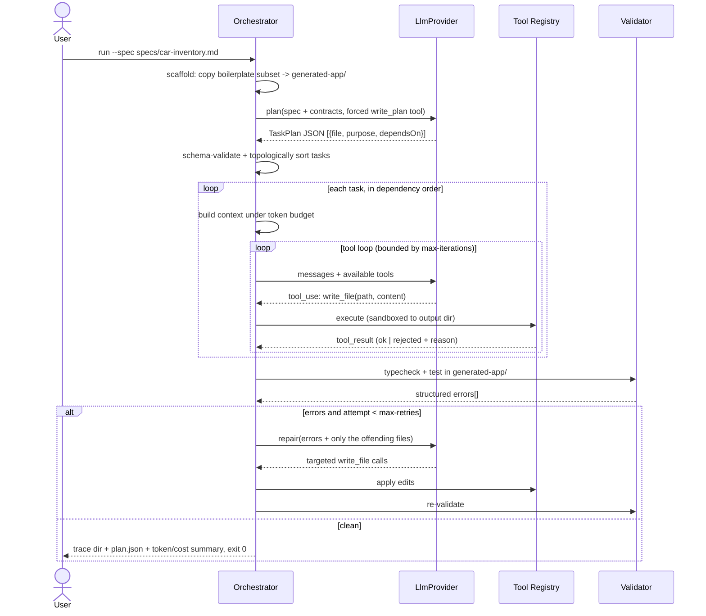

---
type: design
design-id: 2026-09-04-001-design
scope-id: 2026-09-04-001-scope
research-id: 2026-09-04-001-research
status: complete
interactionMode: smart
timestamp: 2026-09-04T22:25:00Z
complexity: VERY_HIGH
tier_recommended: deep

# Design

## Approach

Build a dependency-free TypeScript CLI under `agent/` that runs an explicit, artifact-logged
**plan → generate → validate → repair** pipeline: a provider-agnostic `LlmProvider` interface
with Anthropic + OpenAI adapters over native `fetch`; a deterministic scaffolder that copies the
boilerplate into `generated-app/`; a sandboxed tool registry (`read_file`, `write_file`,
`list_files`, `run_command`); a schema-enforced planner emitting dependency-ordered file tasks;
a per-task tool-calling generator; and a validator that parses real `tsc`/`vitest` output back
into a bounded repair loop.

Why this fits the scoped context and research: the rubric grades the **visible** loop (Agent
Design 25%, Prompt Engineering 15%, Error Handling 10%), so the loop must be our code, not a
framework's; Research found **zero** local precedent for an agent runtime, so the cheapest way to
de-risk it is narrow, offline-testable seams — 13 of 14 units need **no API key**, using a
`FakeProvider` and a mocked `fetch`; and the strict-compiler failure classes flagged as most
likely get pinned in the prompt (U6) and handled explicitly in the error parser (U5).

**Two nested loops, deliberately separated:**

- **Outer loop (deterministic TypeScript, no LLM):** scaffold → plan → order tasks → generate
  each → validate → repair (bounded retries). This is the testable skeleton.
- **Inner loop (LLM-driven, per task):** the model requests tools, we execute them sandboxed to
  the output directory, results feed back, until the model finishes or an iteration cap fires.

## High-Level Technical Design

> **Note:** Directional guidance for review, not an implementation specification to copy.
> Naming, abstractions, and code structure are decided during execution.

**Primary — the agentic loop (sequence, happy path with one repair cycle):**



**Supporting — the contract boundary (data-flow).** The design's key structural idea: the agent
and the generated app are separate systems, with the boilerplate acting as a read-only exemplar
source, so the reference tree can never be mutated by generation.

```
  BOILERPLATE (read-only exemplars)          SPEC (natural language)
  src/types.ts          ┐                    "display cars, sort by year,
  src/graphql/queries   ├─ contracts ──┐      add car form, responsive img"
  src/components/Example│              │            │
  src/__tests__/Example ┘              ▼            ▼
                                  ┌──────────┐  ┌─────────┐
                                  │ PROMPTS  │──│ PLANNER │──> plan.json
                                  │ + rules  │  └─────────┘        │
                                  └──────────┘                     ▼
        SCAFFOLDER: copy boilerplate subset ──> generated-app/     │
                                                       ▲           ▼
                              ┌────────────────────────┴──  GENERATOR (per task)
                              │                                    │
                              │                                    ▼
                              │        VALIDATOR: tsc + vitest ──> errors[]
                              │                                    │
                              └────────  REPAIR (bounded) <────────┘
                                                            │
                                            attempts < max? ─ no ─> fail loudly, exit != 0
                                            (breakpoints 640/1024, noUnusedLocals,
                                             noUncheckedIndexedAccess, @/ alias)
```

## Implementation Units (Phased)

`agent/` is a new sub-project with its own `agent/tsconfig.json` and `agent/vitest.config.ts`.
It is kept out of the app's `tsconfig.json` `include` (`["src", "vite-env.d.ts"]`) so app
typechecking never compiles agent code, and so `generated-app/` stays a clean copy of the
boilerplate. One Acceptance Criterion per unit, so unit → task is 1:1 (14 tasks, inside the Deep
tier's 8–15 guidance).

### Phase 1: Foundation (deterministic; no API key needed)

- U1a. **Sub-project wiring: agent tsconfig, vitest project, scripts, env contract**
  - **Goal:** Establish `agent/` as an independently type-checked and independently tested TypeScript sub-project before any agent logic exists.
  - **Dependencies:** None
  - **Files:**
    - Create: `agent/tsconfig.json`, `agent/vitest.config.ts`
    - Modify: `package.json`, `vitest.config.ts`
    - Test: `agent/tests/wiring.test.ts`
  - **Acceptance Criteria:**
    - `npm run typecheck` compiles only the app (`src/`), `npm run agent:typecheck` compiles only `agent/`, and `agent/**/*.test.ts` executes in a **node** environment that is never swept into the app's jsdom project
  - **Test Scenarios:**
    - Default-glob guard: root `vitest.config.ts` pins `include` to `src/**` -> `agent/tests/*.test.ts` is not collected by `npm run test`
    - Isolation: a deliberate type error inside `agent/src/` -> `npm run typecheck` still passes while `npm run agent:typecheck` fails
  - **Note on `vitest.config.ts`:** it currently declares **no `include`**, so its default glob would sweep agent tests into jsdom; pinning `include` is a prerequisite of this unit, not an optional cleanup. `.env` loading uses Node's `--env-file` (Node >= 20.6, verified locally) rather than adding a `dotenv` dependency.

- U1b. **CLI entry and config resolution**
  - **Goal:** Give the deliverable a runnable `--spec` entry point that resolves provider, model, and loop limits, and fails loudly before any network call.
  - **Dependencies:** U1a
  - **Files:**
    - Create: `agent/src/index.ts`, `agent/src/config.ts`, `.env.example`, `specs/car-inventory.md`
    - Test: `agent/tests/config.test.ts`
  - **Acceptance Criteria:**
    - The CLI parses `--spec`, `--out`, `--provider`, `--model`, `--max-retries`, `--max-iterations`, `--dry-run`, and exits with an error naming the exact missing variable (e.g. `ANTHROPIC_API_KEY`) instead of an ambiguous network failure when no key is present
  - **Test Scenarios:**
    - Full flags: `--spec specs/car-inventory.md --max-retries 2` -> typed config with documented defaults for the rest
    - Missing key: no `ANTHROPIC_API_KEY` -> non-zero exit naming `ANTHROPIC_API_KEY`, zero requests attempted
    - Unknown provider: `--provider gemini` -> rejected, listing supported providers
    - Dry run: `--dry-run` -> the planning path completes with zero HTTP calls via `FakeProvider`
    - Env contract: `.env.example` names `ANTHROPIC_API_KEY`, `OPENAI_API_KEY`, `LLM_PROVIDER`, and no secret value is committed

- U2. **Provider-agnostic LLM adapter**
  - **Goal:** Normalize "messages + tool definitions in, text-or-tool-calls out" behind one interface, with Anthropic and OpenAI HTTP adapters and an offline fake.
  - **Dependencies:** U1b
  - **Files:**
    - Create: `agent/src/llm/provider.ts`, `agent/src/llm/anthropic.ts`, `agent/src/llm/openai.ts`, `agent/src/llm/fake.ts`
    - Test: `agent/tests/llm-adapters.test.ts`
  - **Acceptance Criteria:**
    - `AnthropicProvider` and `OpenAIProvider` each translate internal request/response types to and from their wire format against a stubbed `fetch` (no network), and both satisfy the same interface as `FakeProvider`, including normalized `usage` token counts and a terminal `stopReason`
  - **Test Scenarios:**
    - Anthropic request: internal tool defs -> `tools[].input_schema`, `system` hoisted to top level
    - OpenAI request: same input -> `tools[].function.parameters`, `role: "system"` message
    - Tool call response: each wire shape -> one internal `toolCall` with parsed JSON arguments
    - Malformed arguments: `"arguments": "{bad json"` -> typed adapter error, not an undefined read
    - Non-2xx: 429 -> classified retryable, bounded backoff, then a typed failure

- U3. **Scaffolder: boilerplate copy**
  - **Goal:** Produce an isolated, runnable app copy the agent may mutate, without ever touching the reference `src/`.
  - **Dependencies:** U1b
  - **Files:**
    - Create: `agent/src/scaffold.ts`
    - Test: `agent/tests/scaffold.test.ts`
  - **Acceptance Criteria:**
    - Scaffolding copies the app subset (`src/`, `public/`, `index.html`, `package.json`, `tsconfig.json`, `vite.config.ts`, `vitest.config.ts`) into the output directory and excludes `node_modules/`, `agent/`, `docs/`, and any pre-existing output, refusing to overwrite a non-empty output directory unless `--force` is passed
  - **Test Scenarios:**
    - Fresh: empty out dir -> `generated-app/src/types.ts` present, `generated-app/agent/` absent
    - Clobber guard: out dir already has `src/App.tsx` -> refuses; `--force` replaces
    - Read-only guarantee: reference `src/App.tsx` byte-identical after scaffolding

- U4. **Sandboxed tool registry**
  - **Goal:** Let the model act on the workspace only through validated, allow-listed tools whose results feed back into the loop.
  - **Dependencies:** U2
  - **Files:**
    - Create: `agent/src/tools/registry.ts`, `agent/src/tools/fs.ts`, `agent/src/tools/shell.ts`
    - Test: `agent/tests/tools.test.ts`
  - **Acceptance Criteria:**
    - `read_file`, `write_file`, and `list_files` are confined to the output directory and `run_command` accepts only an allow-listed set of npm scripts, with every rejection returned to the model as a structured `tool_result` error rather than thrown out of the loop
  - **Test Scenarios:**
    - Traversal: `write_file("../../../etc/passwd")` -> rejected, nothing written
    - Outside root: `read_file` of a reference-tree absolute path -> rejected
    - Shell allow-list: `rm -rf .` -> rejected; `typecheck` -> executed
    - Unknown tool name -> error listing available tools
    - Oversized write above the per-file byte cap -> rejected with reason

- U5. **Validation gate with structured error parsing**
  - **Goal:** Convert real compiler and test output into typed, per-file error data the repair loop can act on.
  - **Dependencies:** U3, U4
  - **Files:**
    - Create: `agent/src/validate.ts`, `agent/src/parse-tsc.ts`, `agent/src/parse-vitest.ts`
    - Test: `agent/tests/validate.test.ts`
  - **Acceptance Criteria:**
    - The validator runs `typecheck` and `test` inside the output directory and returns `{ tool, file, line, code, message }[]` covering the `noUncheckedIndexedAccess`, `noUnusedLocals`, and `noUnusedParameters` failure classes, and reports zero errors for the untouched scaffold
  - **Test Scenarios:**
    - Clean: untouched scaffold -> `[]`, `ok: true`
    - Type fixture: `arr[i]` under `noUncheckedIndexedAccess` -> one error with the correct project-relative file path
    - Test fixture: failing `vitest --reporter=json` output -> error mapped to its test file and assertion message
    - Missing deps: no `node_modules` in output dir -> actionable "run npm install" error, not a stack trace

### Phase 2: Agentic loop (LLM integration; driven offline by `FakeProvider`)

- U6. **Prompt library and contract enforcement**
  - **Goal:** Make every model call structured and constrained — role, hard rules, few-shot exemplars, output contract.
  - **Dependencies:** U2
  - **Files:**
    - Create: `agent/src/prompts/planner.ts`, `agent/src/prompts/generator.ts`, `agent/src/prompts/repair.ts`, `agent/src/prompts/exemplars.ts`
    - Test: `agent/tests/prompts.test.ts`
  - **Acceptance Criteria:**
    - Each prompt builder renders the boilerplate's non-negotiable rules — import `GET_CARS`/`ADD_CAR` from `@/graphql/queries`, `Car` from `@/types`, use the `@/` alias, `__typename: "Car"` in fixtures, the 640/1024 breakpoint table, and the four strict-compiler flags — by reading them from the reference files rather than duplicating them as prose
  - **Test Scenarios:**
    - Generator prompt for a card component -> contains the `@/graphql/queries` rule and the `Example.tsx` exemplar
    - Planner prompt -> contains the task-JSON schema instruction and the "do not redefine queries/handlers" rule
    - Drift guard: a `Car` field removed from the fixture disappears from the rendered prompt (proves derivation, not hardcoding)

- U7. **Planner: spec to dependency-ordered task plan**
  - **Goal:** Decompose the spec into ordered, file-level generation tasks instead of one giant prompt.
  - **Dependencies:** U4, U6
  - **Files:**
    - Create: `agent/src/plan.ts`, `agent/src/plan-schema.ts`
    - Test: `agent/tests/plan.test.ts`
  - **Acceptance Criteria:**
    - Given a spec and a stubbed provider response, the planner returns a validated task list (`file`, `purpose`, `dependsOn`, `exports`) in topological order, rejects a schema-invalid response with exactly one corrective re-ask, and fails a plan whose dependencies form a cycle
  - **Test Scenarios:**
    - Valid plan: 5-task JSON -> sorted so the hook precedes its consumers
    - Invalid JSON: prose instead of JSON -> one re-ask carrying the validation error, then success
    - Cycle: `A dependsOn B`, `B dependsOn A` -> planning fails naming the cycle members
    - Forced tool call: planner issues a `write_plan` tool call rather than free text

- U8. **Context builder with token budget**
  - **Goal:** Pass the right slice of context per step without exceeding limits.
  - **Dependencies:** U6
  - **Files:**
    - Create: `agent/src/context.ts`
    - Test: `agent/tests/context.test.ts`
  - **Acceptance Criteria:**
    - For a given task the builder assembles the contract files plus only that task's dependency outputs, elides lowest-priority content until under a configured token budget, and never drops the spec or the hard rules, reporting what it omitted
  - **Test Scenarios:**
    - Squeeze: many sibling files, small budget -> non-droppable sections retained, siblings elided with an explicit marker in `omitted`
    - Dependency scoping: task depending on `useCars` -> that file's content present, an unrelated component absent
    - Growth: files generated by earlier tasks become inputs for later ones

- U9. **Generator: per-task tool-calling loop**
  - **Goal:** Produce each file through a bounded agent loop that requests tools and consumes their results.
  - **Dependencies:** U4, U7, U8
  - **Files:**
    - Create: `agent/src/generate.ts`, `agent/src/agent-loop.ts`
    - Test: `agent/tests/generate.test.ts`
  - **Acceptance Criteria:**
    - Running a task against `FakeProvider` drives real `write_file` tool calls that create the expected files in the output directory, and the loop terminates on the model's final non-tool response or at `--max-iterations`, surfaced as a typed failure and never as an unbounded hang
  - **Test Scenarios:**
    - Happy path: provider emits `write_file` then done -> file on disk with returned content
    - Tool-error recovery: first `write_file` rejected for traversal, second accepted -> loop continues and file is written
    - Iteration cap: provider never terminates -> stops at the cap with a typed `max_iterations` failure
    - Dependency ordering: consumer task's prompt contains its dependency's generated contents

- U10. **Repair loop with bounded retries and stall detection**
  - **Goal:** Read validation output, feed it back, and fix only what failed — the graded error-recovery criterion.
  - **Dependencies:** U5, U9
  - **Files:**
    - Create: `agent/src/repair.ts`, `agent/src/run.ts`
    - Test: `agent/tests/repair.test.ts`
  - **Acceptance Criteria:**
    - When validation reports errors the repair pass sends the error list and only the offending files to the model, applies targeted edits, re-validates, and stops after `--max-retries` **or** immediately on a no-progress signature (identical error fingerprint twice), then exits non-zero with the residual errors
  - **Test Scenarios:**
    - One-fix recovery: injected `TS6133` unused local -> repaired, validation green on attempt 2, exactly 2 provider calls recorded
    - Cap reached: provider keeps failing -> exactly `max-retries` repair calls, then non-zero exit
    - Stall detection: identical error set twice -> stops early rather than burning remaining retries
    - Blast-radius: error in `CarCard.tsx` -> `SearchBar.tsx` bytes unchanged
    - `--max-retries 0`: validation runs once, no repair call, non-zero exit with the error report

### Phase 3: Rollout and submission evidence

- U11. **Run trace, cost accounting, and offline replay**
  - **Goal:** Make the loop auditable for the reviewer and satisfy the cost write-up requirement.
  - **Dependencies:** U9, U10
  - **Files:**
    - Create: `agent/src/run-log.ts`, `agent/tests/fixtures/*.json`
    - Modify: `agent/src/run.ts`
    - Test: `agent/tests/run-log.test.ts`
  - **Acceptance Criteria:**
    - Each run writes a trace directory containing `plan.json`, per-task prompt/response and tool-call records, per-attempt validation output, and a summary whose total input/output tokens and estimated USD cost are summed from provider `usage` fields across every call
  - **Test Scenarios:**
    - Completeness: run against `FakeProvider` -> all four artifact kinds present and valid JSON
    - Cost math: two calls of 1000/500 tokens -> summary cost equals the model rate-table total
    - Failure path: run aborted mid-repair -> trace still written, status marked `failed`
    - Replay: a recorded fixture trace re-runs the pipeline with zero network

- U12. **End-to-end demo run and committed sample output**
  - **Goal:** Prove the loop produces a runnable app and capture it as the submission's sample.
  - **Dependencies:** U1a, U1b, U10, U11
  - **Files:**
    - Create: `generated-app/**` (committed sample output), `agent/tests/e2e-app.test.ts`
    - Modify: `specs/car-inventory.md`
  - **Acceptance Criteria:**
    - One `npm run agent -- --spec specs/car-inventory.md` invocation with a real provider key produces an app where `npm run typecheck` and `npm run test` pass inside `generated-app/`, covering all six required behaviors: Apollo/MSW car list, breakpoint-correct responsive images, MUI cards, AddCar mutation form, model search with year/make sorting, and a `useCars()` hook
  - **Test Scenarios:**
    - Breakpoints: viewport 640 / 641 / 1023 / 1024 px -> mobile / tablet / tablet / desktop URL selected
    - Mutation: submit AddCar -> new car appears through the existing MSW in-memory store
    - Hook contract: `useCars()` exposes `cars`, `loading`, `error` and is the only place `useQuery` appears

- U13. **Generalization check and architecture write-up**
  - **Goal:** Show the agent is spec-driven rather than Car-hardcoded, and document decisions for the secondary 30%.
  - **Dependencies:** U12
  - **Files:**
    - Create: `agent/README.md`, `specs/variant-inventory.md`
    - Modify: `README.md`
    - Test: `agent/tests/generalization.test.ts`
  - **Acceptance Criteria:**
    - A structurally different variant spec (different entity and field names) drives the planner to emit correspondingly renamed files and queries with no source-code change to the agent, and the documentation records the provider choice, the two-loop architecture with the diagram above, the pi-SDK rejection rationale, tradeoffs, and measured cost per run
  - **Test Scenarios:**
    - Variant spec: a "Book Inventory" spec -> plan contains book-shaped files, no `Car` literals reachable from the prompt builders
    - Docs completeness: the write-up contains architecture, tradeoffs, cost, and how-to-run sections

## Complexity Assessment

- **scope_breadth: 2** — multiple modules across two sub-projects (`agent/src/{llm,tools,prompts}`, `specs/`, disposable `generated-app/`), all in one repository; not 3, which requires cross-system or cross-repo reach.
- **integration_surface: 2** — two provider HTTP adapters but exactly **one** active external dependency per run, plus local `tsc`/`vitest` subprocesses; not 3, since there is no database, auth provider, or third-party SDK.
- **risk_level: 3** — **HIGH (multiple areas)**, inherited verbatim from Research (APIs + Complex Logic = 2 high-risk areas). Not re-scored per `design-complexity-assessment.md`.
- **novelty: 3** — new pattern in an unfamiliar domain: zero local precedent for an agent loop, an LLM call, or a CLI entry point. Pi's SDK supplies shape, not a reusable in-repo pattern, so no local pattern is being reused.
- **data_migration: 1** — additive and backward-safe: `generated-app/` and the trace directory are disposable output, no schema or data changes, and the reference `src/` is never mutated. Worst case is `rm -rf generated-app`.
- **total: 11**
- **complexity: VERY_HIGH** (threshold `>= 11`)

**tier_recommended: `deep`** — `HIGH | VERY_HIGH` complexity gives Deep base tier; the HIGH risk
floor is Standard, so Deep is not a downgrade and no risk floor is threatened.

**Sizing caveat (deliberate, not an error):** VERY_HIGH reflects **breadth of new surface** (14
units, two loops), not deep technical uncertainty — the output contract is pinned by 4
HIGH-confidence local patterns, and the true blast radius is small because output is disposable.
The score is reported as the algorithm computes it rather than tuned down to avoid a Smart-mode
pause. The mitigations are that all of Phase 1 is deterministic and 13 of 14 units need no API
key; only U12 requires a real provider call, and its output is committed as evidence.

## Alternative Approaches Considered

Four approaches evaluated. Complexity is VERY_HIGH, so at least two are documented with
side-by-side rationale (three rejected, one deferred as a bonus).

- **Build on the `pi` coding-agent SDK** (`createAgentSession()`, built-in read/edit/write/bash
  tools, `SessionManager`, compaction, event stream) as the agent runtime.
  → **Rejected because:** it hides exactly what is being graded — Agent Design (25%), Prompt
  Engineering (15%), and Error Handling (10%) would be pi's internals, so the reviewer sees a
  wrapper rather than our workflow; it adds ~437 MB / 21 direct dependencies to the evaluator's
  install for a **batch** generator that needs none of the TUI, session-tree, or theme features;
  and it obscures the per-run token/cost attribution the README explicitly requires.
  Licensing was **not** an objection — pi is MIT (`package.json:103`). **Retained as prior art:**
  we borrow its shapes anyway (narrow tool allow-lists and `excludeTools` → U4; a subscribe-able
  event stream → U11's trace; compaction → U8's budget trimming) and cite it in `agent/README.md`.
- **Agent framework (LangGraph / CrewAI / Mastra)** for orchestration and tracing.
  → **Rejected because:** the loop we need is three control-flow constructs (topological task
  order, bounded tool loop, bounded repair loop); a graph runtime buys state-machine features we
  would not use while adding install weight, a learning curve, and indirection between the
  reviewer and our logic — all against a 4-6 h budget. Mastra is the least-bad fit
  (TypeScript-native) but its API surface, not our design, is what would be evaluated.
- **Multi-agent roles (separate planner / coder / critic agents).**
  → **Rejected for the core path because:** the roles collapse into three prompt builders (U6)
  sharing one provider and one loop, so separate agents add token cost and debugging surface for
  no rubric credit. **Kept as the Creativity (10%) follow-up:** U10's re-validation is already a
  deterministic critic, and a second LLM reviewer pass drops in cleanly once the base loop is green.
- **Single-prompt generation** (one call returning the whole app as a file-map JSON).
  → **Rejected because:** it forfeits Agent Design and Error Handling outright, cannot respect the
  token budget once exemplar files are included, and cannot be corrected mid-flight — so it fails
  the "we may modify the spec" generalization test. Recorded as the baseline this design must beat.

## Related Learnings

- **No relevant learnings found.** `docs/learn/index.md` is empty across all four categories
  (decision / pattern / gotcha / workflow), so nothing was carried forward from Scope and no
  local pattern was confirmed or refuted during design. This plan is the first material worth
  capturing via `/learn`.

## Learning Gaps

2 carried from Scope + 2 added by design = **4 total**, which crosses the "3+ gaps" Smart-mode
pause threshold and is surfaced at confirmation.

- **LLM agent-loop orchestration** *(carried)* — domain: `agent-runtime` — no learning covers
  tool-calling loop termination, iteration caps, or feeding tool results back. Follow-up:
  `/learn` after U9/U10; capture the cap-plus-stall termination rule from U10 as a pattern.
- **Provider-agnostic function calling + token budgeting** *(carried)* — domain:
  `llm-integration` — no learning covers normalizing Anthropic `tool_use` vs OpenAI `tool_calls`,
  or budget-driven context trimming. Follow-up: `/learn` after U2/U8; record where the adapters
  genuinely diverge versus where they do not.
- **Machine-readable validation output** *(new, from U5)* — domain: `tooling` — no learning
  covers parsing `tsc` diagnostics and `vitest --reporter=json` into typed per-file errors, and
  this is the most failure-prone seam in the design, since the repair pass depends entirely on it.
  Follow-up: `/learn` a gotcha entry after U5.
- **Responsive image selection in jsdom** *(new, from U12)* — domain: `testing` — no learning
  covers stubbing `window.matchMedia`/viewport width under Vitest + jsdom, without which the hard
  640/1024 requirement cannot be made test-driven at all. Follow-up: `/learn` a pattern entry
  after U12.

## Operational / Rollout Notes (draft, for Generate)

- **Disposability:** `generated-app/` and `agent-runs/` are throwaway; add both to `.gitignore`
  except the single committed U12 sample output. Rollback = delete the directory.
- **Cost control:** iteration and retry caps are the budget; log tokens per call so a runaway loop
  is visible immediately; `--dry-run` and `FakeProvider` allow zero-cost rehearsal of the full pipeline.
- **Secrets:** keys read from environment only; `.env.example` lists `ANTHROPIC_API_KEY` and
  `OPENAI_API_KEY` with the provider selected by `LLM_PROVIDER`; nothing committed, no defaults.
- **Pre-existing repo oddity (needs a decision, not an assumption):** `package.json` lists
  `"arreio": "^1.1.0"` as a **runtime `dependencies`** entry of the *app* boilerplate (added in
  commit `fc4cd72` at the previous session's user request). It is workflow tooling, not app code,
  and it is copied into every `generated-app/`. The plan does **not** remove it unilaterally;
  recommend moving it to `devDependencies` (or dropping it) so the generated app's dependency
  surface stays clean.
- **Node floor:** global `fetch` and `--env-file` require Node >= 20.6 (verified locally on
  Node 26); state this in the README rather than relying on a `dotenv` dependency.
