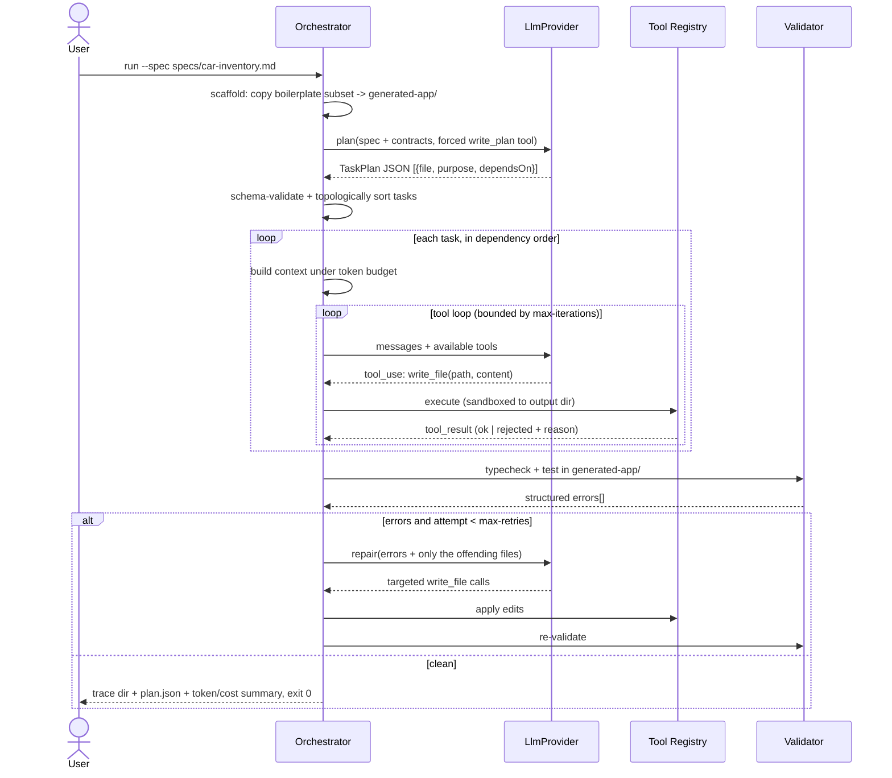

## Overview

Build the graded deliverable from `README.md`: a **CLI agentic workflow** in TypeScript that
reads a natural-language spec, decomposes it into dependency-ordered file tasks, generates a
React + TypeScript app **into a copy of the provided boilerplate**, self-validates with the
project's real `tsc` and `vitest` runs, and iterates on the errors it gets back — with every
stage recorded as an auditable artifact so a reviewer sees a workflow rather than a single
prompt.

Why it matters: `src/App.tsx` is still the placeholder shell and the repository contains **no
agent code at all**, while the rubric allocates 40% of primary marks to the visibility and
quality of the loop itself (Agent Design 25%, Prompt Engineering 15%, Error Handling 10%) and
10% to the agent's own code quality. The app is the *output* being validated; the agent is the
*deliverable* being graded.

**Added in revision 1.1:** the agent must be able to use **skills** — procedural instruction packs
living in `agent/skills/<name>/SKILL.md` inside the agent's own folder. Skills are discovered at
prompt-build time, indexed by name and description, and their bodies injected into the planner,
generator, and repair prompts when a task matches the skill's `when-to-use` condition (U14). This
is the same progressive-disclosure pattern this repository uses for its own
`.agents/skills/` (plan, work, learn, review).

## High-Level Technical Design

> **Note:** This is directional guidance for review, not an implementation specification to copy.
> The implementation phase will determine specific naming, abstractions, and code structure.

**Two nested loops, deliberately separated.** The outer loop is deterministic TypeScript with no
LLM involvement — scaffold, plan, order, generate, validate, repair — and is the part that is
fully unit-testable offline. The inner loop is the per-task function-calling cycle where the model
requests tools and consumes their results. Keeping them separate is what lets 14 of 15 units run
without an API key.



**Cross-system integration map (Deep tier).** The structural idea to hold onto: the agent and the
generated app are **separate systems** with a read-only exemplar flow, so generation can never
mutate the reference tree the next prompt depends on.

```
  BOILERPLATE (read-only exemplars)          SPEC (natural language)
  src/types.ts          ┐                    "display cars, sort by year,
  src/graphql/queries   ├─ contracts ──┐      add car form, responsive img"
  src/components/Example│              │            │
  src/__tests__/Example ┘              ▼            ▼
                                  ┌──────────┐  ┌─────────┐
                                  │ PROMPTS  │──│ PLANNER │──> plan.json
                                  │ + rules  │  └─────────┘        │
                                  └──────────┘                     ▼
        SCAFFOLDER: copy boilerplate subset ──> generated-app/     │
                                                       ▲           ▼
                              ┌────────────────────────┴──  GENERATOR (per task)
                              │                                    │
                              │                                    ▼
                              │        VALIDATOR: tsc + vitest ──> errors[]
                              │                                    │
                              └────────  REPAIR (bounded) <────────┘
                                                            │
                                            attempts < max? ─ no ─> fail loudly, exit != 0
                                            (breakpoints 640/1024, noUnusedLocals,
                                             noUncheckedIndexedAccess, @/ alias)
```

## Implementation Units (Phased)

`agent/` is a new sub-project with its own `agent/tsconfig.json` and `agent/vitest.config.ts`, kept
out of the app's `tsconfig.json` `include` (`["src", "vite-env.d.ts"]`) so app typechecking never
compiles agent code and `generated-app/` stays a clean copy of the boilerplate. One Acceptance
Criterion per unit, so unit -> task is 1:1 (15 tasks, within the Deep tier's 8-15 guidance).

### Phase 1: Foundation (deterministic; no API key needed)

- U1a. **Sub-project wiring: agent tsconfig, vitest project, scripts, env contract**
  - **Goal:** Establish `agent/` as an independently type-checked and independently tested TypeScript sub-project before any agent logic exists.
  - **Dependencies:** None
  - **Files:**
    - Create: `agent/tsconfig.json`, `agent/vitest.config.ts`
    - Modify: `package.json`, `vitest.config.ts`
    - Test: `agent/tests/wiring.test.ts`
  - **Acceptance Criteria:**
    - `npm run typecheck` compiles only the app (`src/`), `npm run agent:typecheck` compiles only `agent/`, and `agent/**/*.test.ts` executes in a **node** environment that is never swept into the app's jsdom project
  - **Test Scenarios:**
    - Default-glob guard: root `vitest.config.ts` pins `include` to `src/**` -> `agent/tests/*.test.ts` is not collected by `npm run test`
    - Isolation: a deliberate type error inside `agent/src/` -> `npm run typecheck` still passes while `npm run agent:typecheck` fails
  - **Note:** the root `vitest.config.ts` currently declares **no `include`**, so its default glob would sweep agent tests into jsdom; pinning it is a prerequisite of this unit, not an optional cleanup. `.env` loading uses Node's `--env-file` (Node >= 20.6, verified locally) rather than adding a `dotenv` dependency.

- U1b. **CLI entry and config resolution**
  - **Goal:** Give the deliverable a runnable `--spec` entry point that resolves provider, model, and loop limits, and fails loudly before any network call.
  - **Dependencies:** U1a
  - **Files:**
    - Create: `agent/src/index.ts`, `agent/src/config.ts`, `.env.example`, `specs/car-inventory.md`
    - Test: `agent/tests/config.test.ts`
  - **Acceptance Criteria:**
    - The CLI parses `--spec`, `--out`, `--provider`, `--model`, `--max-retries`, `--max-iterations`, `--dry-run`, and exits with an error naming the exact missing variable (e.g. `ANTHROPIC_API_KEY`) instead of an ambiguous network failure when no key is present
  - **Test Scenarios:**
    - Full flags: `--spec specs/car-inventory.md --max-retries 2` -> typed config with documented defaults for the rest
    - Missing key: no `ANTHROPIC_API_KEY` -> non-zero exit naming `ANTHROPIC_API_KEY`, zero requests attempted
    - Unknown provider: `--provider gemini` -> rejected, listing supported providers
    - Dry run: `--dry-run` -> the planning path completes with zero HTTP calls via `FakeProvider`
    - Env contract: `.env.example` names `ANTHROPIC_API_KEY`, `OPENAI_API_KEY`, `LLM_PROVIDER`, and no secret value is committed

- U2. **Provider-agnostic LLM adapter**
  - **Goal:** Normalize "messages + tool definitions in, text-or-tool-calls out" behind one interface, with Anthropic and OpenAI HTTP adapters plus an offline fake.
  - **Dependencies:** U1b
  - **Files:**
    - Create: `agent/src/llm/provider.ts`, `agent/src/llm/anthropic.ts`, `agent/src/llm/openai.ts`, `agent/src/llm/fake.ts`
    - Test: `agent/tests/llm-adapters.test.ts`
  - **Acceptance Criteria:**
    - `AnthropicProvider` and `OpenAIProvider` each translate internal request/response types to and from their wire format against a stubbed `fetch` (no network), and both satisfy the same interface as `FakeProvider`, including normalized `usage` token counts and a terminal `stopReason`
  - **Test Scenarios:**
    - Anthropic request: internal tool defs -> `tools[].input_schema`, `system` hoisted to top level
    - OpenAI request: same input -> `tools[].function.parameters`, `role: "system"` message
    - Tool call response: each wire shape -> one internal `toolCall` with parsed JSON arguments
    - Malformed arguments: `"arguments": "{bad json"` -> typed adapter error, not an undefined read
    - Non-2xx: 429 -> classified retryable, bounded backoff, then a typed failure

- U3. **Scaffolder: boilerplate copy**
  - **Goal:** Produce an isolated, runnable app copy the agent may mutate, without ever touching the reference `src/`.
  - **Dependencies:** U1b
  - **Files:**
    - Create: `agent/src/scaffold.ts`
    - Test: `agent/tests/scaffold.test.ts`
  - **Acceptance Criteria:**
    - Scaffolding copies the app subset (`src/`, `public/`, `index.html`, `package.json`, `tsconfig.json`, `vite.config.ts`, `vitest.config.ts`) into the output directory, excludes `node_modules/`, `agent/`, `docs/` and any pre-existing output, and refuses to overwrite a non-empty output directory unless `--force` is passed
  - **Test Scenarios:**
    - Fresh: empty out dir -> `generated-app/src/types.ts` present, `generated-app/agent/` absent
    - Clobber guard: out dir already has `src/App.tsx` -> refuses; `--force` replaces
    - Read-only guarantee: reference `src/App.tsx` byte-identical after scaffolding

- U4. **Sandboxed tool registry**
  - **Goal:** Let the model act on the workspace only through validated, allow-listed tools whose results feed back into the loop.
  - **Dependencies:** U2
  - **Files:**
    - Create: `agent/src/tools/registry.ts`, `agent/src/tools/fs.ts`, `agent/src/tools/shell.ts`
    - Test: `agent/tests/tools.test.ts`
  - **Acceptance Criteria:**
    - `read_file`, `write_file`, and `list_files` are confined to the output directory and `run_command` accepts only an allow-listed set of npm scripts, with every rejection returned to the model as a structured `tool_result` error rather than thrown out of the loop
  - **Test Scenarios:**
    - Traversal: `write_file("../../../etc/passwd")` -> rejected, nothing written
    - Outside root: `read_file` of a reference-tree absolute path -> rejected
    - Shell allow-list: `rm -rf .` -> rejected; `typecheck` -> executed
    - Unknown tool name -> error listing available tools
    - Oversized write above the per-file byte cap -> rejected with reason

- U5. **Validation gate with structured error parsing**
  - **Goal:** Convert real compiler and test output into typed, per-file error data the repair loop can act on.
  - **Dependencies:** U3, U4
  - **Files:**
    - Create: `agent/src/validate.ts`, `agent/src/parse-tsc.ts`, `agent/src/parse-vitest.ts`
    - Test: `agent/tests/validate.test.ts`
  - **Acceptance Criteria:**
    - The validator runs `typecheck` and `test` inside the output directory and returns `{ tool, file, line, code, message }[]` covering the `noUncheckedIndexedAccess`, `noUnusedLocals`, and `noUnusedParameters` failure classes, and reports zero errors for the untouched scaffold
  - **Test Scenarios:**
    - Clean: untouched scaffold -> `[]`, `ok: true`
    - Type fixture: `arr[i]` under `noUncheckedIndexedAccess` -> one error with the correct project-relative file path
    - Test fixture: failing `vitest --reporter=json` output -> error mapped to its test file and assertion message
    - Missing deps: no `node_modules` in output dir -> actionable "run npm install" error, not a stack trace

### Phase 2: Agentic loop (LLM integration; driven offline by `FakeProvider`)

- U6. **Prompt library and contract enforcement**
  - **Goal:** Make every model call structured and constrained — role, hard rules, few-shot exemplars, output contract.
  - **Dependencies:** U2
  - **Files:**
    - Create: `agent/src/prompts/planner.ts`, `agent/src/prompts/generator.ts`, `agent/src/prompts/repair.ts`, `agent/src/prompts/exemplars.ts`
    - Test: `agent/tests/prompts.test.ts`
  - **Acceptance Criteria:**
    - Each prompt builder renders the boilerplate's non-negotiable rules — import `GET_CARS`/`ADD_CAR` from `@/graphql/queries`, `Car` from `@/types`, use the `@/` alias, `__typename: "Car"` in fixtures, the 640/1024 breakpoint table, and the four strict-compiler flags — by reading them from the reference files rather than duplicating them as prose
  - **Test Scenarios:**
    - Generator prompt for a card component -> contains the `@/graphql/queries` rule and the `Example.tsx` exemplar
    - Planner prompt -> contains the task-JSON schema instruction and the "do not redefine queries/handlers" rule
    - Drift guard: a `Car` field removed from the fixture disappears from the rendered prompt (proves derivation, not hardcoding)

- U7. **Planner: spec to dependency-ordered task plan**
  - **Goal:** Decompose the spec into ordered, file-level generation tasks instead of one giant prompt.
  - **Dependencies:** U4, U6
  - **Files:**
    - Create: `agent/src/plan.ts`, `agent/src/plan-schema.ts`
    - Test: `agent/tests/plan.test.ts`
  - **Acceptance Criteria:**
    - Given a spec and a stubbed provider response, the planner returns a validated task list (`file`, `purpose`, `dependsOn`, `exports`) in topological order, rejects a schema-invalid response with exactly one corrective re-ask, and fails a plan whose dependencies form a cycle
  - **Test Scenarios:**
    - Valid plan: 5-task JSON -> sorted so the hook precedes its consumers
    - Invalid JSON: prose instead of JSON -> one re-ask carrying the validation error, then success
    - Cycle: `A dependsOn B`, `B dependsOn A` -> planning fails naming the cycle members
    - Forced tool call: planner issues a `write_plan` tool call rather than free text

- U8. **Context builder with token budget**
  - **Goal:** Pass the right slice of context per step without exceeding limits.
  - **Dependencies:** U6
  - **Files:**
    - Create: `agent/src/context.ts`
    - Test: `agent/tests/context.test.ts`
  - **Acceptance Criteria:**
    - For a given task the builder assembles the contract files plus only that task's dependency outputs, elides lowest-priority content until under a configured token budget, and never drops the spec or the hard rules, reporting what it omitted
  - **Test Scenarios:**
    - Squeeze: many sibling files, small budget -> non-droppable sections retained, siblings elided with an explicit marker in `omitted`
    - Dependency scoping: task depending on `useCars` -> that file's content present, an unrelated component absent
    - Growth: files generated by earlier tasks become inputs for later ones

- U9. **Generator: per-task tool-calling loop**
  - **Goal:** Produce each file through a bounded agent loop that requests tools and consumes their results.
  - **Dependencies:** U4, U7, U8
  - **Files:**
    - Create: `agent/src/generate.ts`, `agent/src/agent-loop.ts`
    - Test: `agent/tests/generate.test.ts`
  - **Acceptance Criteria:**
    - Running a task against `FakeProvider` drives real `write_file` tool calls that create the expected files in the output directory, and the loop terminates on the model's final non-tool response or at `--max-iterations`, surfaced as a typed failure and never as an unbounded hang
  - **Test Scenarios:**
    - Happy path: provider emits `write_file` then done -> file on disk with returned content
    - Tool-error recovery: first `write_file` rejected for traversal, second accepted -> loop continues and file is written
    - Iteration cap: provider never terminates -> stops at the cap with a typed `max_iterations` failure
    - Dependency ordering: consumer task's prompt contains its dependency's generated contents

- U10. **Repair loop with bounded retries and stall detection**
  - **Goal:** Read validation output, feed it back, and fix only what failed — the graded error-recovery criterion.
  - **Dependencies:** U5, U9
  - **Files:**
    - Create: `agent/src/repair.ts`, `agent/src/run.ts`
    - Test: `agent/tests/repair.test.ts`
  - **Acceptance Criteria:**
    - When validation reports errors the repair pass sends the error list and only the offending files to the model, applies targeted edits, re-validates, and stops after `--max-retries` **or** immediately on a no-progress signature (identical error fingerprint twice), then exits non-zero with the residual errors
  - **Test Scenarios:**
    - One-fix recovery: injected `TS6133` unused local -> repaired, validation green on attempt 2, exactly 2 provider calls recorded
    - Cap reached: provider keeps failing -> exactly `max-retries` repair calls, then non-zero exit
    - Stall detection: identical error set twice -> stops early rather than burning remaining retries
    - Blast-radius: error in `CarCard.tsx` -> `SearchBar.tsx` bytes unchanged
    - `--max-retries 0`: validation runs once, no repair call, non-zero exit with the error report

- U14. **Skill discovery and prompt injection (`agent/skills/`)**
  - **Goal:** Let the agent use procedural skills from `agent/skills/<name>/SKILL.md` — discovered, indexed, and injected into prompts on demand — instead of hardcoding procedural knowledge in prompt builders.
  - **Dependencies:** U6, U8
  - **Files:**
    - Create: `agent/src/skills.ts`, `agent/skills/README.md`
    - Modify: `agent/src/prompts/planner.ts`, `agent/src/prompts/generator.ts`, `agent/src/prompts/repair.ts`, `agent/src/config.ts`
    - Test: `agent/tests/skills.test.ts`
  - **Acceptance Criteria:**
    - The loader parses frontmatter (`name`, `description`, `when-to-use`) from each `SKILL.md`, renders a skill index (name + description only) into the planner/generator/repair system prompts, and injects the full body as procedural instructions only when a task's context matches `when-to-use`; a missing or empty `agent/skills/` directory is a no-op, and malformed frontmatter is skipped with a warning rather than aborting the run
  - **Test Scenarios:**
    - Index: two fixture skills -> system prompt contains both names and descriptions, no body text
    - Injection: task matching a skill's `when-to-use` -> full `SKILL.md` body present in that task's generator prompt
    - No-op: no `agent/skills/` dir -> prompts render identically to the U6 baseline (drift-guard still green)
    - Malformed: one skill with bad frontmatter -> run continues, warning logged, other skills still indexed
  - **Note:** Skill files are read at prompt-build time by the agent itself, not through the sandboxed tool registry (U4), so reading from `agent/skills/` outside `generated-app/` is a deliberate read-only exception — do NOT route skill loading through the sandboxed `read_file` tool. `--skills-dir` (default `agent/skills/`) resolves relative to the repo root. Added in plan revision 1.1.

### Phase 3: Rollout and submission evidence

- U11. **Run trace, cost accounting, and offline replay**
  - **Goal:** Make the loop auditable for the reviewer and satisfy the cost write-up requirement.
  - **Dependencies:** U9, U10
  - **Files:**
    - Create: `agent/src/run-log.ts`, `agent/tests/fixtures/*.json`
    - Modify: `agent/src/run.ts`
    - Test: `agent/tests/run-log.test.ts`
  - **Acceptance Criteria:**
    - Each run writes a trace directory containing `plan.json`, per-task prompt/response and tool-call records, per-attempt validation output, and a summary whose total input/output tokens and estimated USD cost are summed from provider `usage` fields across every call
  - **Test Scenarios:**
    - Completeness: run against `FakeProvider` -> all four artifact kinds present and valid JSON
    - Cost math: two calls of 1000/500 tokens -> summary cost equals the model rate-table total
    - Failure path: run aborted mid-repair -> trace still written, status marked `failed`
    - Replay: a recorded fixture trace re-runs the pipeline with zero network

- U12. **End-to-end demo run and committed sample output**
  - **Goal:** Prove the loop produces a runnable app and capture it as the submission's sample.
  - **Dependencies:** U1a, U1b, U10, U11
  - **Files:**
    - Create: `generated-app/**`, `agent/tests/e2e-app.test.ts`
    - Modify: `specs/car-inventory.md`
  - **Acceptance Criteria:**
    - One `npm run agent -- --spec specs/car-inventory.md` invocation with a real provider key produces an app where `npm run typecheck` and `npm run test` pass inside `generated-app/`, covering all six required behaviors: Apollo/MSW car list, breakpoint-correct responsive images, MUI cards, AddCar mutation form, model search with year/make sorting, and a `useCars()` hook
  - **Test Scenarios:**
    - Breakpoints: viewport 640 / 641 / 1023 / 1024 px -> mobile / tablet / tablet / desktop URL selected
    - Mutation: submit AddCar -> new car appears through the existing MSW in-memory store
    - Hook contract: `useCars()` exposes `cars`, `loading`, `error` and is the only place `useQuery` appears

- U13. **Generalization check and architecture write-up**
  - **Goal:** Show the agent is spec-driven rather than Car-hardcoded, and document decisions for the secondary 30%.
  - **Dependencies:** U12
  - **Files:**
    - Create: `agent/README.md`, `specs/variant-inventory.md`
    - Modify: `README.md`
    - Test: `agent/tests/generalization.test.ts`
  - **Acceptance Criteria:**
    - A structurally different variant spec (different entity and field names) drives the planner to emit correspondingly renamed files and queries with no source-code change to the agent, and the documentation records the provider choice, the two-loop architecture with the diagram above, the pi-SDK rejection rationale, tradeoffs, and measured cost per run
  - **Test Scenarios:**
    - Variant spec: a "Book Inventory" spec -> plan contains book-shaped files, no `Car` literals reachable from the prompt builders
    - Docs completeness: the write-up contains architecture, tradeoffs, cost, and how-to-run sections

## Alternative Approaches Considered

Complexity is VERY_HIGH, so alternatives are compared side-by-side on the two axes that actually
decide it: **does the reviewer see our loop?** and **what does the evaluator have to install?**

| Approach | Loop visible to reviewer? | Added install weight | Fit vs 4-6 h budget | Verdict |
| --- | --- | --- | --- | --- |
| Hand-rolled TS loop (**chosen**) | Fully visible | None (native `fetch`) | Fits; 13/14 units offline | **Selected** |
| `pi` coding-agent SDK | Hidden in pi internals | ~437 MB / 21 direct deps | Faster to *run*, slower to debug blind | Rejected |
| LangGraph / CrewAI / Mastra | Visible but mediated by framework API | Framework + transitive deps | Learning curve inside budget | Rejected |
| Multi-agent planner/coder/critic | Visible, but more of it | None | Higher token cost + debugging surface | Deferred to bonus |
| Single-prompt generation | None exists | None | Fits, but fails the rubric by construction | Rejected |

- **Build on the `pi` coding-agent SDK** (`createAgentSession()`, built-in read/edit/write/bash
  tools, `SessionManager`, compaction, event stream) as the agent runtime. Technically the
  shortest path to *working output* — pi already does this, it is MIT-licensed
  (`package.json:103`), and its `examples/sdk/01-minimal.ts` -> `12-full-control.ts` are good
  references.
  → **Rejected because:** it hides exactly what is being graded — Agent Design (25%), Prompt
  Engineering (15%), and Error Handling (10%) would be pi's internals, so the submission reads as
  a wrapper; it adds ~437 MB / 21 direct dependencies to the evaluator's `npm install` for a
  **batch** generator that needs none of the TUI, session-tree, or theme machinery; and it
  obscures the per-run token/cost attribution the README explicitly requires. Licensing was never
  the objection, visibility was. **Retained as prior art:** its shapes are borrowed anyway —
  narrow tool allow-lists and `excludeTools` -> U4, a subscribe-able event stream -> U11's trace,
  compaction -> U8's budget trimming — and it is cited in `agent/README.md`.
- **Agent framework (LangGraph / CrewAI / Mastra)** for orchestration, state, and tracing.
  → **Rejected because:** the required loop is three control-flow constructs (topological task
  order, bounded tool loop, bounded repair loop); a graph runtime buys state-machine features that
  go unused while adding install weight, a learning curve, and indirection between the reviewer and
  our logic. Mastra is the least-bad fit (TypeScript-native), but then its API surface rather than
  our design is what gets evaluated.
- **Multi-agent roles (separate planner / coder / critic agents).**
  → **Rejected for the core path because:** the roles collapse into three prompt builders (U6)
  sharing one provider and one loop, so separate agent processes add token cost and debugging
  surface for no rubric credit. **Kept as the Creativity (10%) follow-up:** U10's re-validation is
  already a deterministic critic, and an LLM "reviewer" pass drops in cleanly once the base loop is
  green — as do bounded parallel generation of independent tasks and a
  `(model, prompt hash)` response cache for repeat calls.
- **Single-prompt generation** (one call returning the whole app as a file-map).
  → **Rejected because:** it forfeits Agent Design and Error Handling outright, cannot respect the
  token budget once exemplar files are included, and cannot be corrected mid-flight — so it fails
  the "we may modify the spec slightly" generalization test. Recorded as the baseline this design
  must demonstrably beat.

## Risk Analysis & Mitigation

Risk level is **High** (Research: APIs + Complex Logic — two HIGH areas, no Security/Payments, so
not Critical). Impact ratings and rollback are included per the Deep tier.

| Risk | Impact | Likelihood | Mitigation |
| --- | --- | --- | --- |
| Provider wire-format drift — `tool_use` vs `tool_calls`, `input_schema` vs `function.parameters`, `system` placement differ | High | High | U2 pins one internal message/tool type and tests each adapter against a **stubbed `fetch`**, so a shape mistake is a failing unit test, not a demo-day outage; API versions sent explicitly in each request; a run with a real key is scheduled early (U12), not last |
| Generated code fails `typecheck` under `strict` + `noUnusedLocals` + `noUnusedParameters` + `noUncheckedIndexedAccess` | High | High | The four flags are named verbatim in the generator prompt (U6, derived from `tsconfig.json` not from prose); U5 parses TS codes into per-file errors; U10 repairs with only the offending files in context |
| Repair loop never converges -> runaway wall-clock and token spend | High | Medium | Two independent caps (`--max-iterations` inner, `--max-retries` outer) plus U10's **no-progress fingerprint** that halts on a repeated identical error set; tokens logged per call so a runaway is visible immediately; `--dry-run`/`FakeProvider` rehearses the whole pipeline at zero cost |
| A model tool call writes outside `generated-app/` or clobbers the reference `src/` | High | Low | U4 sandbox rejects traversal and absolute escapes and returns the rejection to the model as a `tool_result`; `run_command` allow-listed to the boilerplate npm scripts; U3 asserts the reference `src/App.tsx` is byte-identical after a run |
| Agent is secretly Car-Inventory-hardcoded -> fails the modified-spec test | Medium | Medium | Rules derived from files rather than duplicated (U6's drift-guard test); no feature list hardcoded in the planner prompt; U13 runs a variant entity spec end-to-end and asserts the plan and filenames change |
| Root `vitest.config.ts` has no `include`, so its default glob runs agent tests under jsdom | Medium | High | U1 pins root `include` to `src/**` and gives `agent/` its own `agent/vitest.config.ts` with the `node` environment; asserted by a config-isolation test scenario in U1 |
| The 640/1024 breakpoint requirement cannot be tested (jsdom has no meaningful `matchMedia`) | Medium | Medium | Generation prompt requires a `matchMedia`/viewport stub in the generated test setup, making the breakpoint rule test-first as specified; U12 asserts 640/641/1023/1024 -> mobile/tablet/tablet/desktop |
| Repair edits spread beyond the broken file and regress working code | Medium | Medium | U10 targets only files named in the error list and asserts an untouched sibling stays byte-identical; full `typecheck` + `test` re-run after every repair, so regressions resurface as errors instead of shipping |
| Model emits empty, truncated, or refusal content | Medium | Medium | Per-file byte cap plus non-empty assertion in U4/U9; rejection returned as `tool_result` so the loop retries in-context rather than aborting the run |
| Reviewer sees one large commit and cannot trace the design (README's "How You Work Matters") | Medium | High without this | 15 tasks, one AC and one test each, committed individually via the Work skill; U11's trace directory is committed evidence; this plan and its artifacts already exist under `docs/plans/` |
| Skill files bloat context or inject conflicting instructions into prompts | Medium | Low | Skills are trusted repo-local files read read-only at prompt-build time; only name + description are indexed by default, the full body loads only on a `when-to-use` match, and U8's budget trimming still applies — skill content can never displace the spec or hard rules |
| Evaluator lacks a key for the selected provider, or cannot reproduce a run | Medium | Medium | `.env.example` names both keys and provider is auto-detected from whichever key is present; U11's replay fixture lets CI and the evaluator verify the loop with **zero** network and no key |
| External research unverified — `web_search` is unconfigured here (Ollama 401), so provider docs were not consulted | Low | High | Accepted deliberately: every other contract is verifiable in-repo, and both provider wire formats are pinned by U2's mocked-`fetch` tests, so a documentation mistake shows up as a red test; the queries remain recorded in the Research artifact for the implementation phase |

**Rollback plan.** Every unit is independently revertible: Phase 1 modules are pure functions with
their own tests, and Phase 2 modules consume them through narrow interfaces, so reverting U9 or U10
leaves a working (if dumber) CLI. `generated-app/` and the trace directory are disposable
(`rm -rf`, gitignored except the one committed sample) and the reference `src/` is never written to,
so no unit can corrupt the input it needs to retry. `arreio`'s workflow state stays in `docs/`, so a
failed plan iteration costs the plan file, not the code.

## Operational / Rollout Notes

- **Feature flags / switches:** `--dry-run` (planning only, zero HTTP), `LLM_PROVIDER`
  (`anthropic` | `openai`, defaulting to whichever API key is present), `--force` (replace a
  non-empty output dir), `--max-retries` and `--max-iterations` (the two cost caps),
  `--out` (defaults to `generated-app`), `--skills-dir` (defaults to `agent/skills/`, skill
discovery root). Deferred bonus switches: a `--cache` opt-in keyed by
  `(model, prompt hash)`, and `--parallel N` for independent tasks.
- **Monitoring / observability:** each run writes `agent-runs/<timestamp>/` with `plan.json`,
  per-task prompt/response and tool-call records, per-attempt validation logs, and a `run.json`
  carrying total input/output tokens, estimated USD cost, iteration counts, and terminal status
  (`green` | `stalled` | `cap-exhausted` | `failed`). Cost is summed from provider `usage` fields,
  not estimated from text length, so the README's cost claim is measured.
- **Data migration:** none. No schema or data changes anywhere; the app's only "database" is MSW's
  in-memory array, which the agent must not touch (`README.md` forbids scaffolding a backend).
- **Performance baseline:** target one full spec-to-green run inside the 4-6 h submission budget —
  roughly 1 planning call + ~6-9 generation turns + 2-3 validation/repair cycles, i.e. under ~20
  provider calls and a token cost in the low single-digit USD range per run. Inner-loop cap default
  8 iterations, outer-repair cap default 3 retries; both overridable.
- **Node floor:** global `fetch` and `--env-file` require Node >= 20.6 (verified locally on Node
  26). Stated in the README rather than papered over with a `dotenv` dependency.
- **Repo hygiene decision (needs the user's call, not an assumption):** `package.json` lists
  `"arreio": "^1.1.0"` under **`dependencies`** — workflow tooling added in commit `fc4cd72`, not
  app code — and the scaffolder copies it into every `generated-app/`. Recommended: move to
  `devDependencies` or drop it, so the generated app's runtime dependency surface stays clean. This
  plan deliberately does **not** remove it unilaterally.
- **Submission checklist (U11-U13 close these out):** agent source, `README.md` with setup +
  architecture + decisions, sample spec, sample output directory, `.env.example`, and the
  write-up covering provider choice, architecture diagram, what worked / what to improve, and cost
  per run.

## Related Learnings

- **No relevant learnings found.** `docs/learn/index.md` is empty across all four categories
  (decision / pattern / gotcha / workflow), so nothing was carried from Scope and no existing
  pattern was confirmed or refuted during design. This plan is the first material worth capturing
  via `/learn`.
- **External prior art (not a repo learning, deliberately not a dependency):** the `pi`
  coding-agent SDK — `docs/sdk.md` and `examples/sdk/` — for tool allow-lists, event-stream
  subscription, and compaction-style context budgeting. Rejected as a base (see Alternative
  Approaches); cited as prior art in `agent/README.md`.

## Learning Gaps

4 gaps (crosses the 3+ threshold; drove the Smart-mode Design pause). Each has a follow-up action
via `/learn` after the owning unit lands.

- **LLM agent-loop orchestration** — domain `agent-runtime` — loop termination conditions,
  iteration caps, and feeding tool results back have no precedent here. Capture after **U9/U10**,
  as a `pattern` entry, including U10's cap-plus-stall termination rule.
- **Provider-agnostic function calling + token budgeting** — domain `llm-integration` — nothing
  documents normalizing Anthropic `tool_use` against OpenAI `tool_calls`, or budget-driven context
  trimming. Capture after **U2/U8**, recording where the adapters genuinely diverge versus where
  they do not.
- **Machine-readable validation output** — domain `tooling` — parsing `tsc` diagnostics and
  `vitest --reporter=json` into typed per-file errors is the most failure-prone seam in this
  design, since the repair pass depends entirely on it. Capture after **U5**, as a `gotcha` entry
  with the concrete TS codes encountered in the trace.
- **Responsive image selection in jsdom** — domain `testing` — stubbing
  `window.matchMedia`/viewport width under Vitest + jsdom is undocumented, and without it the hard
  640/1024 requirement cannot be test-driven at all. Capture after **U12**, as a `pattern` entry.
