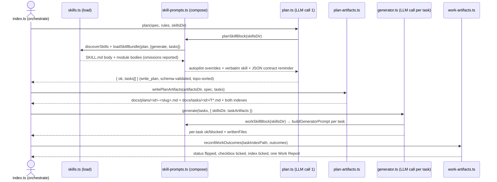

## Overview

Re-point `agent/` at the repository's own workflow skills instead of at bespoke prompt prose. The
planner call executes `.agents/skills/plan` (Scope → Research → Design → Generate → Tasks) pinned to
**autopilot** with the **Tasks phase always on**, so every run leaves a plan document and one task
artifact per Acceptance Criterion in `docs/tasks/<plan-id>/`; the implementation stage executes
`.agents/skills/work`'s **Execute** phase once per task artifact, test-first, and records the outcome
back into the task file and index.

Why it matters: the agent's planner prompt was a weaker, drifting copy of what the skills already
specify — and the better-built prompt in `agent/src/prompts/generator.ts` was **dead code**: the loop
sent its own ad-hoc `"You are a code generation assistant"` system turn instead, so nothing in the
agent followed a documented procedure at all. With the skills as the single source of truth, editing
`plan/modules/tasks.md` changes how the agent plans, and the run's artifacts become the handoff a
human (or `/work`) can continue from. Intermediate phase dumps (`.scope/`, `.research/`, `.design/`,
`.work/**`) are deliberately **not** written: they exist to give a human something to approve between
phases, there is nothing to approve here, and the run trace already holds the transcripts.

# The agent/ CLI runs the plan and work skills (autopilot, task files always)

## High-Level Technical Design

> **Note:** This is directional guidance for review, not an implementation specification to copy.
> The implementation phase determines specific naming, abstractions, and code structure.

**Three layers, one direction of dependency.** Loading (filesystem → text), composition (skill text →
binding prompt block), materialization (LLM answer → durable artifacts). Only the composition layer
touches a prompt; only the materialization layer touches `docs/`.



```
spec → [plan skill · autopilot · 5 phases in one pass] → Task[] (JSON, validated)
     → [deterministic render] → docs/plans/<plan-id>-<slug>.md + docs/tasks/<plan-id>/T<NN>-*.md + indexes
     → per task: [work skill · Execute] write test (Red) → write impl (Green) → refactor
     → [deterministic bookkeeping] status + checkbox + index tick + one Work Report block
```

**Data flow and its invariants**

| Invariant                                     | Where it is enforced                                                                 |
| --------------------------------------------- | ------------------------------------------------------------------------------------ |
| One AC → one task → one test                  | `TASK_PLAN_JSON_SCHEMA` optional keys + `planningConstraints()` + `renderTaskArtifact` (`files.test` has exactly one entry) |
| Task artifacts are always produced            | `writePlanArtifacts` is unconditional in `orchestrate()`; a failure logs and continues rather than skipping silently |
| No intermediate phase dumps                   | Nothing writes `.scope/.research/.design/.work`; asserted by tests, stated in the plan frontmatter (`phases-inlined`) and in both injected overrides |
| Skill text never outranks the output contract | the JSON-array contract stays at the **top** of the planner system turn and is restated **after** the skill body |
| Bookkeeping is resume-safe                    | `recordWorkOutcomes` is forward-only: a `completed` task is never re-opened, checkboxes only tick up, the report block is replaced in place |
| Missing skills degrade, not explode           | `buildSkillBlock` returns `""` when the id or directory is absent; `discoverSkills` already no-ops |

## Implementation Units (Phased)

### Phase 1: Foundation

- U1. **Green baseline for the agent sub-project**
  - **Goal:** Start from a suite that is actually green, so every later change is measured against a clean gate.
  - **Dependencies:** None
  - **Files:**
    - Modify: `agent/tests/generalization.test.ts`
  - **Acceptance Criteria:**
    - `npm run agent:typecheck` exits 0, i.e. the two pre-existing unused-import errors (`writeFileSync`, `join`) in `agent/tests/generalization.test.ts` are gone
  - **Test Scenarios:**
    - Gate check: `npm run agent:typecheck` -> exit code 0, no `TS6133` output

- U2. **Skill discovery that covers the repository's own skills**
  - **Goal:** Make `.agents/skills/*` loadable: those skills are invoked by name, so they carry no `when-to-use`; and a single LLM call needs a skill's phase modules inlined, not linked.
  - **Dependencies:** U1
  - **Files:**
    - Modify: `agent/src/skills.ts`, `agent/tests/skills.test.ts`, `agent/src/config.ts`
  - **Acceptance Criteria:**
    - `discoverSkills` requires only `name` + `description`, yields `whenToUse: ""` for skills without the key, and still skips a skill missing either required field with a warning
    - `loadSkillBundle(meta, { modules, maxBytes })` inlines the requested `<skillDir>/modules/<name>.md` bodies in the order asked (frontmatter stripped) and reports every non-included module as `missing`, `over-budget` or `read-error` instead of dropping it silently
  - **Test Scenarios:**
    - Arreio-style frontmatter: `SKILL.md` with `name` + `description` only -> discovered with `whenToUse === ""`
    - Module request order: `["tasks", "generate"]` -> both included, `included` preserves the order
    - Budget pressure: `maxBytes` below a module's size -> `omitted: [{ name, reason: "over-budget" }]`
    - Real repo skills: `.agents/skills` -> `plan` bundles `generate`+`tasks`, `work` bundles `execute`

- U3. **Binding skill blocks for a run with no user**
  - **Goal:** Turn a human-orchestrated skill into a procedure one LLM call can actually follow, without discarding the output contracts the pipeline already depends on.
  - **Dependencies:** U2
  - **Files:**
    - Create: `agent/src/skill-prompts.ts`
    - Modify: `agent/src/prompts/planner.ts`, `agent/src/prompts/generator.ts`, `agent/tests/prompts.test.ts`
  - **Acceptance Criteria:**
    - The planner's system turn carries the `plan` skill verbatim plus overrides that pin `interactionMode: autopilot`, forbid asking questions, state that Phase 5 (Tasks) is never skipped, forbid writing `.scope/`, `.research/` and `.design/` — and it closes with the bare-JSON-array contract restated **after** the skill body
    - The per-task prompt carries the `work` skill scoped to one task's Execute phase, forbids `.work/.triage|.prepare|.execute|.review` dumps, and `skillsDir: ""` renders a prompt with no skill block at all
  - **Test Scenarios:**
    - Autopilot pinned: planner system -> contains `Interaction mode: **autopilot**` and `never ask a question`
    - Precedence: `indexOf("Final note on output format") > indexOf("Workflow skill:")`
    - Isolation: `skillsDir: ""` -> no `Workflow skill:` substring in the system turn
    - Skipped dumps: generator system -> contains `docs/plans/.work/.triage/` inside a "Do NOT write" rule

### Phase 2: Integration

- U4. **Tasks-phase output contract the validator can check**
  - **Goal:** Let the planner emit what a task artifact needs (one criterion, one test, three steps) without weakening the four keys the generator already consumes.
  - **Dependencies:** U3
  - **Files:**
    - Modify: `agent/src/prompts/planner.ts`, `agent/src/plan-schema.ts`, `agent/src/plan.ts`, `agent/tests/plan.test.ts`, `agent/tests/prompts.test.ts`
  - **Acceptance Criteria:**
    - `TASK_PLAN_JSON_SCHEMA` keeps `file`/`purpose`/`dependsOn`/`exports` as its entire required set, declares the Tasks-phase keys as optional, opts into `additionalProperties`, and `validateTaskPlan` type-checks exactly the declared keys off that same object — so advertised shape and accepted shape cannot diverge
  - **Test Scenarios:**
    - Back-compat: 4-key task object -> valid
    - Wider answer: object with `title`, `unit`, `acceptanceCriterion`, `testFile`, `steps`, `priority`, `effort` -> valid
    - Unknown future key -> valid (information, not a defect)
    - Type violation: `steps: "red"` -> invalid, named error

- U5. **Durable plan artifacts, generated every run**
  - **Goal:** Materialize the Generate + Tasks phases from the planner's answer — deterministically, no extra LLM call, no prose drift.
  - **Dependencies:** U4
  - **Files:**
    - Create: `agent/src/plan-artifacts.ts`
    - Modify: `agent/src/config.ts`, `agent/tests/plan-artifacts.test.ts`
  - **Acceptance Criteria:**
    - `writePlanArtifacts` writes `docs/plans/<plan-id>-<slug>.md` carrying every field the plan skill's field list requires (`plan-id`, `type`, `title`, `status`, `tier`, `tier_recommended`, `complexity`, `risk`, `scope-id`, `research-id`, `design-id`, `interactionMode`, `created`, `updated`, `version`), a High-Level Technical Design rendered from the task graph, phased Implementation Units, and a Risk Analysis derived from the plan's own gaps
    - Exactly one task artifact per planned file at `docs/tasks/<plan-id>/T<NN>-<slug>.md`, each with a single Acceptance Criterion, exactly one `files.test` entry, three Red → Green → Refactor steps, `status: not-started`, and `dependencies` resolved to sibling `<plan-id>-T<NN>` ids
    - `docs/plans/index.md` and `docs/tasks/<plan-id>/index.md` are created or updated idempotently, and `allocatePlanId` counts both existing plan files and existing task folders while ignoring the dot-directories
  - **Test Scenarios:**
    - Empty plan: `tasks: []` -> `{ ok: false, error: "empty task list" }`, nothing written
    - Id index: same plan registered twice -> one table row
    - Id allocation: `plans/…-001-x.md` + `tasks/…-002/` -> next id `…-003`; `.work/2026-…-007-execute.md` ignored
    - Derived risk: 2 of 3 tasks without a criterion -> the plan says so in words

- U6. **Work-phase execution and forward-only bookkeeping**
  - **Goal:** Execute one task artifact at a time under the work skill, then record what actually happened back into the artifacts.
  - **Dependencies:** U5
  - **Files:**
    - Create: `agent/src/work-artifacts.ts`
    - Modify: `agent/src/prompts/generator.ts`, `agent/src/generator.ts`, `agent/tests/prompts.test.ts`, `agent/tests/generator.test.ts`, `agent/tests/work-artifacts.test.ts`
  - **Acceptance Criteria:**
    - The per-task ask names the task's test file before its implementation file and states the criterion and three steps, so the executor writes Red before Green
    - `generate()` drives the loop from `buildGeneratorPrompt` (no ad-hoc system string), still honours the context token budget for dependency outputs, and reports which files a task wrote plus the task artifact it executed
    - `recordWorkOutcomes` flips each task file's frontmatter `status`, ticks its `## Acceptance Criteria` box only on completion, records a `## Blocked` reason otherwise, ticks the matching index line, and never re-opens a task already `completed`
    - The task index carries exactly one `## Work Report — <plan-id>-run` block, replaced in place on a re-run, stating that the phase artifacts were skipped — and no `docs/plans/.work/`, `.scope/`, `.research/` or `.design/` directory exists after a run
  - **Test Scenarios:**
    - Test-first ordering: user turn -> `CarCard.test.tsx` appears before the last mention of `CarCard.tsx`
    - Blocked task: `status: blocked` + reason line, criterion box still `- [ ]`
    - Resume: completed then blocked -> file byte-identical
    - Rerun report: two passes -> one `## Work Report` heading, counts updated to `2/2`

### Phase 3: Rollout

- U7. **CLI runs the two-skill pipeline in autopilot**
  - **Goal:** Make the documented behaviour the behaviour of a real invocation, provable offline.
  - **Dependencies:** U6
  - **Files:**
    - Modify: `agent/src/index.ts`, `agent/src/config.ts`, `agent/tests/pipeline-skills.test.ts`, `agent/README.md`, `agent/skills/README.md`
  - **Acceptance Criteria:**
    - One `run()` invocation with an offline provider scaffolds, plans through the `plan` skill, writes the plan + task artifacts, executes every task through the `work` skill, and records outcomes — proven by an offline test that asserts the artifacts and their final statuses on disk
    - `agent/README.md` documents the plan→work wiring, the `--artifacts-dir` flag, the `.agents/skills` default for `--skills-dir`, and what a run deliberately does not write
  - **Test Scenarios:**
    - Offline run: `run(["--spec", …, "--out", …, "--artifacts-dir", …])` with a scripted provider -> exit 0, plan file exists, task files `status: completed`, index ticked
    - Prompt provenance: first provider request's system turn mentions the `plan` skill; a later request's mentions the `work` skill

## Alternative Approaches Considered

- **Point `--skills-dir` at `agent/skills/` and copy the skills in:** duplicate of `.agents/skills`, free to drift, and the repo's own skills are the authority the user named → **Rejected because:** it destroys the single-source-of-truth property the change exists to create; `.agents/skills` is now the default and the flag still allows an override.
- **A second LLM call to author the plan document's prose (overview, risks, alternatives):** more faithful to the interactive Generate phase, extra cost, and a new compliance failure mode on a path the user already had to harden against `{tasks: […]}` wrapping → **Rejected because:** the same content derives deterministically from the task graph; the one thing that cannot be derived (a wrong risk table) is worse than a risk table built from the plan's own observable gaps.
- **Let the model write the plan and task files through `write_file`:** matches how a human session does it → **Rejected because:** the tool sandbox confines writes to `--out` by design (T05), and letting the model author frontmatter under a validation gate it can also see invites exactly the drift the artifact renderer removes.
- **Keep the model's "one file per turn" rule and generate the test as a separate task:** no change to the generator's contract → **Rejected because:** it breaks the one-AC-one-test invariant — the test would be written by a different call, after the implementation it is supposed to precede.
- **Full dump of every phase module into both prompts:** maximally faithful (plan skill + 5 modules ≈ 13.5k tokens; work skill + 4 modules ≈ 17.5k) → **Rejected because:** the executor call repeats per task per iteration; a named allowlist plus a byte cap and a reported omission is honest and bounded.
- **Write the `.work/` phase artifacts too:** literal compliance with the Work skill → **Rejected because:** the user asked for the final result only, and the run trace plus the task index report already carry that information.

## Risk Analysis & Mitigation

| Risk                                                                     | Impact | Mitigation                                                                                                                                       |
| ------------------------------------------------------------------------ | ------ | ------------------------------------------------------------------------------------------------------------------------------------------------ |
| Skill bodies instruct markdown output, so the planner answers in prose    | High   | Contract stays at the top of the system turn and is restated after the skill body; forced `write_plan`; schema validation + exactly one typed re-ask; `plan.test.ts` covers the prose-recovery path              |
| Prompt size grows per call (plan ≈ 6.6k tokens once, work ≈ 5.7k per task iteration) | Medium | Named module allowlist, 40 KB per-block cap with omissions reported, stable system turn (cacheable), `--max-iterations` still bounds the loop     |
| Injected skill text collides with prompts.test.ts `ruleLine` uniqueness   | Medium | Checked before implementing (0 collisions across both skills); `skillsDir: ""` escape hatch renders a skill-free prompt for contract-only tests    |
| Arreio skills use `references/*.md` the model cannot open                  | Medium | `loadSkillBundle` inlines the modules that matter; `buildSkillBlock` degrades to `""` when a skill or directory is missing, so a thin checkout still runs |
| Model writes the test but not the implementation (more files per turn)    | Medium | `generate()` records `writtenFiles` from the tool transcript, and a task missing its own file stays `blocked`, never `completed`                  |
| Status flipped to `completed` without the app compiling                    | Medium | Bookkeeping is driven by per-task loop outcomes and logged errors surface; the follow-on wiring of `validate()` + the repair loop into `orchestrate()` is the durable fix (Learning Gaps) |
| Writing into the repo's `docs/` on every run collides with `/plan` ids    | Low    | `allocatePlanId` counts plan files **and** task folders, ignores dot-directories, and `--artifacts-dir` redirects the whole tree                  |
| `planPath`/`taskPath` recorded as given (relative or absolute) double-prefixes | Low | `recordWorkOutcomes` takes the paths as written and never re-joins them with `artifactsDir`; tests assert that                                   |

## Operational / Rollout Notes

- **Feature flag / escape hatches:** `--skills-dir ""`-equivalent is not a flag; callers pass an empty `skillsDir` to the prompt builders, which renders a skill-free prompt. `--skills-dir <dir>` points at a different skill tree; `--artifacts-dir <dir>` moves plan/task artifacts out of `docs/`.
- **Cost baseline:** 1 planner call (rules + spec + `plan` SKILL.md + `generate`/`tasks` modules) + 1–3 executor calls per task (`work` SKILL.md + `execute` module). Expect roughly 12–15k input tokens per run before this change's overhead was measured; capture the real number on the first keyed run.
- **Run trace:** `--out` and the trace directory are unchanged; every skill-augmented request is recorded, so a prompt regression is diffable against an older trace (`agent trace replay`).
- **Rollback:** delete the generated `--out` directory; `docs/plans/<plan-id>-*.md`, its `index.md` row and `docs/tasks/<plan-id>/` are the only repo-side writes, and `git checkout` reverts them.
- **Resume semantics:** re-running `/work <plan-id>` or the pipeline resumes at the first non-`completed` task; completed tasks and the report block are never rewound.
- **Next session:** the remaining scope is 3 tasks — see `docs/tasks/2026-09-05-001/index.md`; run `/work 2026-09-05-001` to execute them.

## Related Learnings

- **Prove Zero-Network Paths with Two Injection Spies** — `docs/learn/pattern/dry-run-zero-network-proven-by-injection-spies.md` — the offline `run()` test in U7 injects a provider spy; `--dry-run` must stay HTTP-free by construction.
- **Loud Fake Exhaustion Reads Like a Production Bug** — `docs/learn/gotcha/scripted-fake-exhaustion-mimics-adapter-bug.md` — U7's scripted provider must carry exactly plan + (iterations × tasks) responses.
- **Sentinel Stubs Keep the Red Gate at Assertion Level** — `docs/learn/pattern/sentinel-stub-red-gate-assertion-level.md` — the new prompt/artifact tests assert on sentinel content, not on file existence alone.
- **Re-Verify the Checked-Out Branch Before Every Commit** — `docs/learn/workflow/recheck-branch-before-each-commit.md` — this work continues on `work/cli-agentic-code-generator`.
- **A Mutation Check That Silently No-Ops Reports Fake Evidence** — `docs/learn/gotcha/mutation-check-silent-noop-fakes-test-strength.md` — the bundle-omission and forward-only-status tests are the ones most likely to pass vacuously; each asserts the reported reason, not just the outcome.

## Learning Gaps

- **Non-interactive injection of interactive skills:** what has to be overridden (mode, phase gates, artifact writes, question-asking) to make a human-orchestrated skill safe for an autonomous loop — capture as a `pattern` learning once a keyed run has been observed.
- **Skill-size budgeting:** rules of thumb for how much skill text belongs in a per-task system turn versus a per-plan one, measured against cost and pass-rate — capture as a `decision` after the first real run's cost accounting.
- **Validation gate ownership:** whether task `status` should be set by per-loop outcome (as designed in U6) or held back until `validate()` + the repair loop are wired into `orchestrate()` — this plan's T14/T15 surface the question; close it with `/learn` after the follow-on change.
