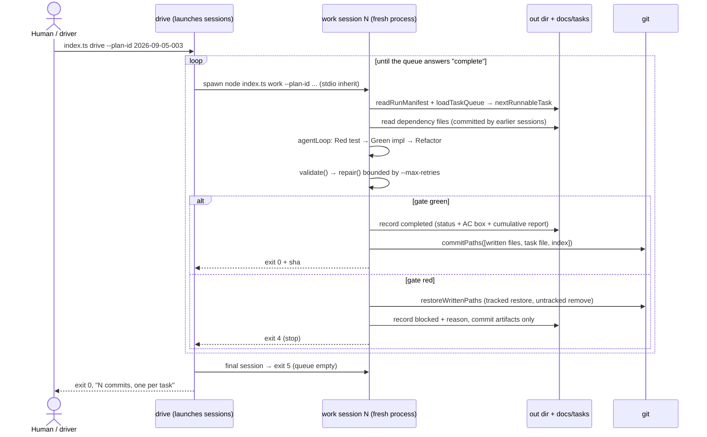

## Overview

Today `agent/src/index.ts::run()` is **one call that does everything**: one planner LLM call (all five
`plan`-skill phases), then an in-process `for` loop in `generator.ts::generate()` that executes every
task, then bookkeeping — a 15-task spec dies with the process, and nothing it produced is recoverable
except by re-running. This plan splits that call into **stages that are separate process invocations**:
a `plan` session that ends as soon as the task artifacts are written and committed, and one `work`
session per task that reads its queue position and its dependencies **from disk**, gates itself on
`typecheck` + `test`, commits its own task, and exits — with a `drive` command whose only job is to
launch a fresh session until the task index is empty.

Why it matters: the boundary that makes an agentic run trustworthy is not the LLM call, it is the
**commit**. Per-session processes turn `docs/tasks/<plan-id>/index.md` plus git history into the only
shared state, so a crash, a budget cut, or a model that cannot crack one task costs exactly one task —
and every unit of progress is a reviewable, revertible commit named after the task it closed. This is
also where the pipeline finally earns `validate.ts` and `repair.ts`: written for the outer repair loop,
never wired into the CLI at all, they become the pre-commit gate.

# Split the agent pipeline into per-task sessions with git-commit boundaries

## High-Level Technical Design

> **Note:** This is directional guidance for review, not an implementation specification to copy. The
> implementation phase determines specific naming, abstractions, and code structure.

**Three stages, three invocations, one handoff.** The handoff is on disk and nowhere else: the task
index (queue + resume manifest), the task files (status), the output directory (dependency code), and
git (the boundary that makes a task's completion real).



```
plan session : spec → [LLM 1 · plan skill · 5 phases] → docs/plans/<id>.md
                                                    + docs/tasks/<id>/T*.md + index(+manifest)
                                                    → commit scaffold+artifacts → EXIT 0
work session : index manifest → queue → one task → [LLM 2..N · work Execute] → gate(validate→repair)
             → green: record + commit + EXIT 0     → red: restore + record blocked + EXIT 4
             → queue already empty: EXIT 5         → nothing runnable: EXIT 3
drive        : while (spawn work) == 0; stop on 3/4, finish on 5, never exceed --max-sessions
```

**Two seams keep the split testable offline.** `GitRunner` (mirrors the existing `ScriptRunner` seam)
so no test touches a real repository, and `SessionLauncher` so a test can run "N separate sessions" as
N in-process calls with one `FakeProvider` — production launches
`spawn(process.execPath, [entry, "work", ...], { stdio: "inherit" })`, no shell.

**The model never commits.** `run_command` stays allow-listed to `typecheck|test|build`; the commit is
harness-side and deterministic. A model that could forge its own acceptance evidence would make the
per-task commit worth nothing.

**Explicit refusal beats a silent fallback**, three times in this design: a dirty tree at session start
is refused **before** any model call; an `--out` that `.gitignore` covers (the repo's own
`generated-app/`) fails fast naming `.gitignore` and the `--force-add` escape; a task whose dependency
files are absent from disk is typed `missing_dependency_output` rather than re-planned.

## Implementation Units (Phased)

### Phase 1: Foundation (pure, offline primitives — nothing spawns anything)

- U1. **Stage grammar and exit-code vocabulary**
  - **Goal:** Let one CLI address three stages, and give "done" and "blocked" codes the driver can branch on.
  - **Dependencies:** None
  - **Files:**
    - Modify: `agent/src/config.ts`
    - Test: `agent/tests/cli-stages.test.ts`
  - **Acceptance Criteria:**
    - `resolveConfig` accepts a leading subcommand (`plan`, `work`, `drive`, `trace`), defaults a bare `--spec` run to the `plan` stage, parses `--plan-id`, `--task`, `--gate validate|none`, `--no-commit`, `--force-add`, `--max-sessions`, and `agent/src/index.ts` exports the five exit codes (0, 2, 3, 4, 5) as named constants
  - **Test Scenarios:**
    - Bare flags: `--spec x.md` → stage `plan`; `work --plan-id 2026-09-05-003` → stage `work`
    - Gate: `--gate none` → `validateGate: false`; `--gate bogus` → config error naming the two values
    - Budget: `--max-sessions 0` → config error ("must be >= 1"); unset → default 50
    - Codes: `EXIT_TASK_BLOCKED === 4`, `EXIT_QUEUE_EMPTY === 5`, all five distinct

- U2. **Run manifest in the task index frontmatter**
  - **Goal:** A later session resumes from the artifacts alone, with no re-typed flags.
  - **Dependencies:** None
  - **Files:**
    - Create: `agent/src/run-manifest.ts`
    - Modify: `agent/src/plan-artifacts.ts`, `agent/tests/plan-artifacts.test.ts`
    - Test: `agent/tests/run-manifest.test.ts`
  - **Acceptance Criteria:**
    - `writePlanArtifacts` records `spec:`, `out:`, `provider:`, `model:` in `<artifactsDir>/tasks/<plan-id>/index.md` frontmatter and `readRunManifest()` returns them typed, naming every missing key in a failure that tells the operator which flag to pass
  - **Test Scenarios:**
    - Round trip: write → read returns the four values byte-for-byte
    - Legacy index (plans 2026-09-04-001, 2026-09-05-001): four named misses, no throw, message names `--out`/`--spec`
    - Override: a CLI `--out` flag beats the manifest value

- U3. **Queue reader: next / complete / stalled**
  - **Goal:** Turn the checklist into the scheduler it already describes.
  - **Dependencies:** None
  - **Files:**
    - Create: `agent/src/queue.ts`
    - Test: `agent/tests/queue.test.ts`
  - **Acceptance Criteria:**
    - `loadTaskQueue` + `nextRunnableTask` return `{kind:"task"}` for the first unchecked task whose every dependency is `completed`, `{kind:"complete", total}` when all lines are checked, and `{kind:"stalled"}` naming the unchecked tasks and their unmet dependencies when nothing is runnable — with a `blocked` task treated as re-runnable and a `completed` one never re-opened
  - **Test Scenarios:**
    - All unchecked → first line; T01 checked → second
    - `completed` everywhere → `{kind:"complete", total:N}`
    - Unchecked with unchecked dep → `stalled`, lists both ids, runs nothing
    - Index and task-file status disagree → file wins, reported

- U4. **Git seam: commit boundary and scoped revert**
  - **Goal:** One commit per unit of accepted work, and a revert that can only touch this session's files.
  - **Dependencies:** None
  - **Files:**
    - Create: `agent/src/git.ts`
    - Test: `agent/tests/git.test.ts`
  - **Acceptance Criteria:**
    - An injectable `GitRunner` backs `requireCleanTree`, `commitPaths` (explicit path list only, never `add -A`, never writes `.gitignore`, `git check-ignore` pre-flight failing with `paths_ignored` unless `--force-add`, `git branch --show-current` re-read immediately before committing, returns `{sha, branch}`) and `restoreWrittenPaths` (tracked restore plus removal of the untracked files this session wrote)
  - **Test Scenarios:**
    - Commit: `add -- <paths>` then `commit -m`, short sha returned, no `-A` argument ever passed
    - Ignored: `--out generated-app` on this repo → `paths_ignored` naming `.gitignore`; with `forceAdd` → `add -f --`
    - Dirty: non-empty `status --porcelain` → refusal before any model call, no stash
    - Restore: tracked file → `restore --source=HEAD`; untracked written file → removed; foreign untracked file → untouched

### Phase 2: Integration (one task per process)

- U5. **`executeTask`: one task, dependencies read from disk**
  - **Goal:** Remove the in-memory `generatedFiles` map as the carrier of cross-task state.
  - **Dependencies:** None
  - **Files:**
    - Modify: `agent/src/generator.ts`
    - Test: `agent/tests/execute-task.test.ts`
  - **Acceptance Criteria:**
    - `executeTask` runs exactly one task through the agent loop with dependency file contents read from the output directory on disk, types an absent dependency file as `missing_dependency_output`, and `generate` is re-expressed as a thin in-process loop over it so no per-task logic exists twice
  - **Test Scenarios:**
    - Dep committed on disk → its contents reach the prompt
    - Dep absent → `missing_dependency_output`, model never called
    - `generate([a,b])` and two `executeTask` calls produce identical prompts

- U6. **Cumulative work report across sessions**
  - **Goal:** The closing block must describe the plan, not the last session.
  - **Dependencies:** None
  - **Files:**
    - Modify: `agent/src/work-artifacts.ts`, `agent/tests/work-artifacts.test.ts`
    - Test: `agent/tests/work-artifacts.test.ts`
  - **Acceptance Criteria:**
    - After any number of sessions the index carries exactly one `## Work Report — <plan-id>-run` block whose completed count is taken from the whole checked list (`N/total`), whose `Status:` reads `complete` only when every line is checked, and which is replaced in place rather than stacked
  - **Test Scenarios:**
    - Session 3 of 5 → `3/5 completed`, `Status: incomplete`
    - Final session → `5/5`, `Status: complete`
    - Re-run after completion → one block, not two; sections after it survive

- U7. **The `work` stage: one session = one task → gate → record → commit**
  - **Goal:** Make a session self-contained and its outcome durable, in both directions.
  - **Dependencies:** U1, U2, U3, U4, U5, U6
  - **Files:**
    - Create: `agent/src/work.ts`
    - Modify: `agent/src/index.ts`
    - Test: `agent/tests/work-stage.test.ts`
  - **Acceptance Criteria:**
    - `index.ts work --plan-id <id>` opens a session that runs one task, gates it with `validate` and `repair` bounded by `--max-retries` (skipped by `--gate none`), and then either records `completed` and commits `[written files, task file, index]` exiting 0, or restores only that session's written files, records `blocked`, commits the artifact-only record and exits 4 — exiting 5 on an empty queue, 3 on a stalled one, and refusing a dirty tree before any model call
  - **Test Scenarios:**
    - Green: exit 0, one commit with exactly three path groups, task `completed`, report `1/N`
    - Red gate: repair attempted, then `blocked`, no modified files left, exit 4
    - Queue empty → exit 5 with zero provider calls; stalled → exit 3 naming the task
    - Dirty tree → exit 2, `provider.complete` never called (injection spy)

### Phase 3: Rollout (entry points, proof, documentation)

- U8. **The `plan` stage stops after the artifacts**
  - **Goal:** The first call ends when the plan is on disk and committed — never executing.
  - **Dependencies:** U1, U2, U4
  - **Files:**
    - Modify: `agent/src/index.ts`
    - Test: `agent/tests/plan-stage.test.ts`
  - **Acceptance Criteria:**
    - `index.ts plan --spec <path>` scaffolds, plans, writes and registers the plan and task artifacts, commits scaffold plus artifacts, exits 0 having issued no executor call, and prints the exact `work`/`drive` command to continue — a bare `--spec` run behaving identically
  - **Test Scenarios:**
    - Provider scripted for exactly one call: extra call throws (loud fake exhaustion) → proves no executor turn
    - Artifacts on disk + one commit naming `[plan-id] plan`
    - stdout contains `drive --plan-id <id>`
    - `--no-commit` → artifacts present, zero commits, exit 0

- U9. **`drive`: launch a fresh session until the queue answers "complete"**
  - **Goal:** Automate the loop the human was the loop for.
  - **Dependencies:** U1, U7, U8
  - **Files:**
    - Create: `agent/src/drive.ts`
    - Modify: `agent/src/index.ts`
    - Test: `agent/tests/drive.test.ts`
  - **Acceptance Criteria:**
    - `drive --plan-id <id> [--max-sessions N]` launches one session per remaining task through an injectable `SessionLauncher` (production: a `node` child process per session, no shell, `stdio: "inherit"`), stops at the first blocked or failed session propagating its code, and exits 0 when a session reports the queue empty
  - **Test Scenarios:**
    - Three tasks → three launches, args differ only by nothing (each session re-reads the queue)
    - Session returns 4 → driver returns 4 after exactly that launch
    - `--max-sessions 2` with 5 tasks → stops at 2, names the resume command, non-zero
    - Production launcher path builds `process.execPath` + entry, never a shell string

- U10. **Rewrite the offline proof for the split; delete the one-process loop**
  - **Goal:** One test file must show that plan, execute, and finish are three calls.
  - **Dependencies:** U5, U6, U7, U8, U9
  - **Files:**
    - Create: `agent/tests/pipeline-sessions.test.ts`
    - Modify: `agent/tests/pipeline-skills.test.ts`, `agent/tests/generator.test.ts`, `agent/src/generator.ts`
    - Test: `agent/tests/pipeline-sessions.test.ts`
  - **Acceptance Criteria:**
    - Offline with `FakeProvider`, a scripted `GitRunner` and an in-process `SessionLauncher`: the plan stage writes and commits the artifacts, each work session is a separate call committing exactly its own task, a blocked task leaves no modified files and stops the driver, a re-run on a complete list exits 5 with zero provider calls — and `generate()` no longer exists
  - **Test Scenarios:**
    - 3 tasks → 1 planner call + 3 executor calls, 4 commits, report `3/3 complete`
    - Blocked mid-list → no dirty paths, driver exit 4, remaining task still `not-started`
    - Resume: rerun after the block is cleared → only the pending task executes
    - Zero network: `createProvider` spy + `fetch` spy both at zero

- U11. **Publish the run's surface: derived `--help` plus the session docs**
  - **Goal:** A reader must be able to run, resume, and roll back a split pipeline from the CLI's own output and the README alone — and the enumeration must be impossible to leave behind when a flag is added.
  - **Dependencies:** U9, U10
  - **Files:**
    - Create: `agent/tests/cli-help.test.ts`
    - Modify: `agent/src/index.ts`, `agent/README.md`, `docs/plans/architectures/cli-agentic-architecture.md`
    - Test: `agent/tests/cli-help.test.ts`
  - **Acceptance Criteria:**
    - `index.ts --help` prints the three stages, every flag in `FLAG_NAMES` and the five exit codes from the same constants `resolveConfig` and the stage dispatch use, and `agent/README.md` plus the architecture doc describe the same surface — stages with commands, exit-code table, `--gate`/`--no-commit`/`--force-add`/`--max-sessions`/`--plan-id`/`--task`, per-session trace naming `<plan-id>-<T NN>`, and the breaking redefinition of a bare `--spec` run with its migration line
  - **Test Scenarios:**
    - Usage completeness: `FLAG_NAMES` ⊆ help output, four subcommands named
    - Coherence: a `--gate bogus` error lists the same values the usage block advertises
    - Help needs no `--spec` and issues no provider call
    - The prose is review-verified, not grepped: a markdown assertion proves a string exists, never that a command works

## Alternative Approaches Considered

**Fresh LLM conversation per task, inside the existing single process** — `run()` keeps orchestrating;
each task starts an empty message history; "session" means conversation.

|                     | Conversations-per-process (rejected) | Sessions-per-process (chosen)                                    |
| ------------------- | ------------------------------------ | ---------------------------------------------------------------- |
| Durable boundary    | none — a crash loses every later task | one commit per task; a crash costs at most the running task       |
| Cross-task state    | in-process `generatedFiles` map       | disk + git only; a session can be resumed by a different machine  |
| Resume              | re-run the whole plan                 | `work`/`drive` reads the index and starts at the first gap        |
| Blast radius of a bad task | the process, its trace dir, its budget | that task's files, which `restoreWrittenPaths` puts back       |
| Cost                | cheaper (no cold starts, no gate)     | +1 `node` start and +1 typecheck/test per task                    |

**Rejected because:** it keeps the two properties the request is about — process-level shared state and
the absence of a rollback point — and adds the least value per line changed.

- **An external driver (a shell `until` loop, a human re-running `/work`, or launching `pi` per task)** → **Rejected as the default, kept as legal:** nothing here requires `drive`. `work` is idempotent and resumable, so an external loop works. What it cannot give is the exit-code contract, the in-process test seam, and the ordering guarantees, which is why the shipped default is in-CLI and `SessionLauncher` exists as the swap point.
- **A JSON/JSONL run log or SQLite state instead of the index + git** → **Rejected:** it duplicates the queue the task index already is, and throws away revert, blame, and review. The only new durable field goes where the index's own frontmatter already lives.
- **Commit per generated file, or one commit at the end of the run** → **Rejected:** the task is the unit of acceptance, so it is the unit of commit; a per-file commit cannot prove the AC, and an end-of-run commit is the single-call failure mode back again.
- **Branch-per-run (the work skill's optional work branch)** → **Deferred, not rejected:** `drive` runs on the checked-out branch and re-reads `git branch --show-current` immediately before every commit (`docs/learn/workflow/recheck-branch-before-each-commit.md`). Choosing a branch is a `/work` Triage decision, out of scope for the loop itself.

## Risk Analysis & Mitigation

| Risk | Impact | Mitigation |
| --- | --- | --- |
| Revert/clean wipes work the run does not own (a human edit or an orphaned file inside `--out` after a crashed session) | High | `restoreWrittenPaths` touches **only** the paths this session wrote (tracked → `git restore --source=HEAD`; untracked → removed); `requireCleanTree` refuses a dirty tree before the model is called, so an orphaned session is surfaced for a human decision instead of being silently cleaned. |
| `--out` is gitignored (`generated-app/` is in this repo's `.gitignore`), so commits silently carry only the artifacts and the code is never versioned | High | `git check-ignore` pre-flight on the exact path list; an ignored path fails with `paths_ignored`, naming `.gitignore` and the fix, unless `--force-add` is passed (`git add -f`). Never edits the user's `.gitignore`; never `add -A`. |
| Breaking the CLI contract and ~1 100 lines of existing offline proof (`pipeline-skills.test.ts`, `generator.test.ts`) | Medium | The break is the deliverable, so it is taken once and deliberately: U1 keeps `trace` working, U5 keeps `generate()` as a thin wrapper until U10 deletes it (no intermediate red commit), U10 retargets the proofs in the same task that removes the function, and U11 documents the migration line. |
| The per-task gate costs a full typecheck + test every session | Medium | `--gate none` for cheap passes; `--max-retries 0` to validate once without repairing; the cost is stated in the rollout notes so it is chosen, not discovered. |
| Child-process spawn deadlocks or swallows output in the driver | Low | `spawn` with an argument array (no shell), `stdio: "inherit"` (no pipe to fill), and the launcher seam makes the production path a one-line review rather than an untested branch. |
| A task that is legitimately red mid-plan (its test depends on a file a later task writes) can never commit | Medium | The invariant is asserted, not assumed: one AC + one test per task, dependency-ordered, is exactly the plan skill's contract. Where it does happen the outcome is visible and recoverable — `blocked` with a recorded reason, exit 4, driver stopped, queue intact. `--gate none` is the operator's override. |
| Model tries to commit through the sandbox | Low | `run_command`'s allow-list is unchanged (`typecheck|test|build`); commits are harness-side only, so the escalation is a `command_not_allowed` tool result, never a commit. |

## Operational / Rollout Notes

- **Config switches (no feature-flag service exists here; the CLI is the surface):**
  `--gate validate|none` (default `validate` — the strictest setting is the default),
  `--no-commit` (record without committing: tests and rehearsal),
  `--force-add` (gitignore override, off by default),
  `--plan-id` / `--task` (resume the list, or re-run one named task),
  `--max-sessions` (default 50), `--max-retries` (repair budget per session), `--max-iterations` (tool loop per task).
- **Monitoring:** exit codes are the status protocol (0 progress · 2 config/refused · 3 generation or stalled queue · 4 task blocked · 5 queue empty); the cumulative `## Work Report — <plan-id>-run` block is the human-facing one-glance record; each session writes its own trace dir named `<plan-id>-<T NN>` so `trace replay` addresses one task, and each commit message names the task id and carries the AC as its body.
- **Migration:** indexes written before this change carry no manifest keys, so the first `work` session on plans 2026-09-04-001 or 2026-09-05-001 fails naming the four keys; pass `--out`/`--spec` explicitly on that first session (flags override the manifest) and the index is rewritten with them. No other migration: task statuses are already forward-only and the queue reads what is on disk.
- **Rollback:** one commit per task, linear and named. `git revert <sha>` undoes one task (its artifact tick rewinds with it, so the queue becomes re-runnable); `git reset --hard <sha>` abandons everything after a point; deleting `--out` and `docs/tasks/<plan-id>/` abandons the run. The plan stage's commit is the base every task commit assumes.
- **Performance baseline (re-measure from a real run, then `/learn` it):** per-task overhead = one `node` cold start (~100–200 ms) + one `npm run typecheck` + one `npm run test` in the boilerplate. Against a 15-task plan that is 15 gate cycles and 15 spawns — noise next to 15 executor LLM calls, which is where the wall clock actually lives. LLM tokens per session are unchanged (one planner turn, one executor turn per task); skill injection still caps at `SKILL_BLOCK_MAX_BYTES` per prompt.
- **Deliberately out of scope:** parallel/dependent-subtree execution (the queue is serial by construction), pushing to a remote, branch selection, and the `.scope/.research/.design/.work` phase dumps, which remain skipped by design.

## Related Learnings

- **Re-Verify the Checked-Out Branch Before Every Commit** — `docs/learn/workflow/recheck-branch-before-each-commit.md` — DIRECT: U4 commits in a repo an external session-end automation may have moved mid-run, so the branch is re-read immediately before each commit, not once at start.
- **Spawn the Real CLI Entry in Tests (No tsx, No New npm Scripts)** — `docs/learn/workflow/spawn-real-cli-entry-in-tests.md` — DIRECT: U9's production launcher and U10's proof must exercise `node agent/src/index.ts <stage>` behind the existing `isDirectExecution()` guard, not a re-implemented argv.
- **Prove Zero-Network Paths with Two Injection Spies** — `docs/learn/pattern/dry-run-zero-network-proven-by-injection-spies.md` — DIRECT: U7's "dirty tree refused before any model call" and U10's offline claim are structural (provider + fetch spies at zero), not inferred.
- **Sentinel Stubs Keep the Red Gate at Assertion Level** — `docs/learn/pattern/sentinel-stub-red-gate-assertion-level.md` — DIRECT: `queue.ts`, `git.ts`, `run-manifest.ts`, `work.ts`, `drive.ts` are created as type-correct stubs so each new test fails on its AC, not on an import error.
- **Test Config Isolation Behaviourally, Not by Regex-on-Config** — `docs/learn/pattern/test-config-isolation-behaviorally-not-regex.md` — DIRECT: assert the argv a `GitRunner`/`SessionLauncher` received, never that a source file contains a string; and it is why U11 has no markdown-grep test.
- **Agent tsconfig Stands Alone, Never Extends the App Root** — `docs/learn/decision/agent-tsconfig-standalone-no-extends-app-root.md` — DIRECT: every new module is under `agent/src/` and compiles in the node unit only; `agent:typecheck` is the gate that proves it.
- **TS Block Comments Silently Closed By Embedded Globs** — `docs/learn/gotcha/ts-block-comment-glob-star-slash-terminates-early.md` — DIRECT: header comments in the new files must not write `agent/**/*.test.ts` inside `/* */`.

## Learning Gaps

- Whether a typecheck+test gate per task ever blocks a legitimately-ordered plan (a task whose test needs a file a later task owns) — if it does, that is the plan skill's "one AC, one test, dependency-ordered" contract failing in practice, not the gate's. Capture the first real occurrence with `/learn`.
- The interaction between per-session commits and this repo's `/end-session` automation (which checks out main, merges, and pushes mid-run): what happens when a session's `requireCleanTree` meets an automation-created commit between two sessions. Record the observed sequence.
- Actual per-run cost of the split: gate seconds, spawn count, token count vs. the pre-split trace in `docs/samples/e2e/`. Measure and record so the README's cost section stops pre-dating reality.
